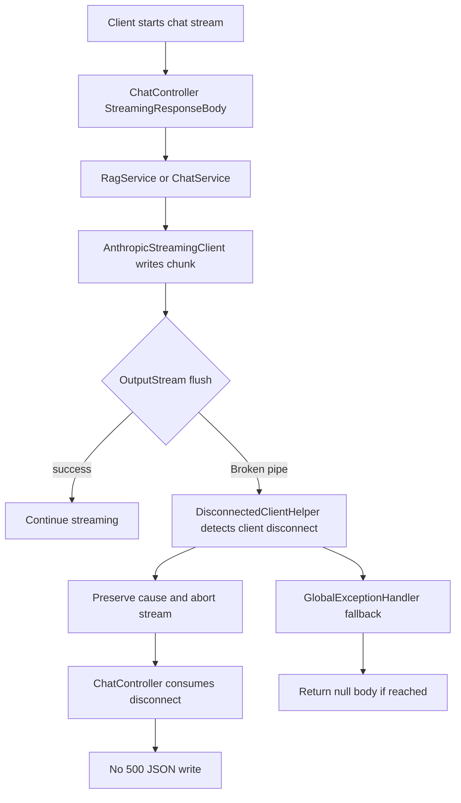

# 20260608-2244 Chat Client Disconnect Handling

## 작업한 내용

- 채팅 스트리밍 중 클라이언트 연결이 먼저 끊긴 경우(`Broken pipe`, `AsyncRequestNotUsableException`)를 정상적인 스트림 종료로 처리하도록 수정했다.
- `AnthropicStreamingClient`가 client disconnect 원인을 `LLM_REQUEST_FAILED`/`LLM_STREAM_FAILED`로 덮어쓰지 않고 원인 체인을 유지해 전파하도록 변경했다.
- `ChatController`의 `StreamingResponseBody` 경계에서 Spring `DisconnectedClientHelper`가 client disconnect로 판별한 예외를 debug 로그 후 소비하도록 변경했다.
- `GlobalExceptionHandler`가 client disconnect 예외를 500 JSON 응답으로 다시 쓰지 않고 `null` body로 종료하도록 변경했다.
- 관련 회귀 테스트를 추가했다.

## 설계 의도

- `Broken pipe`는 서버가 응답을 쓰는 도중 클라이언트가 연결을 닫았다는 뜻이므로 서버 오류 응답을 다시 작성하면 안 된다.
- 스트리밍 응답은 이미 일부 바이트가 전송된 뒤 실패할 수 있으므로, 닫힌 응답에 `ErrorResponse` JSON을 쓰는 전역 예외 처리 흐름을 차단했다.
- 연결 종료 판별은 직접 문자열 비교 로직을 만들지 않고 Spring Web의 `DisconnectedClientHelper`를 사용했다.

## 임의로 결정한 부분

- 클라이언트 연결이 끊긴 경우에는 사용자에게 별도 오류 payload를 보내지 않는다. 연결이 이미 닫힌 상태라 서버가 보낸 payload를 받을 수 없기 때문이다.
- LLM 스트리밍 중 연결 종료가 발생하면 해당 스트림은 중단된다. 이 경우 `ChatService`/`RagService`의 기존 `finally` 흐름에 따라 assistant 응답이 완성되지 않았으면 사용자 메시지만 저장된다.
- API 경로, 요청/응답 스키마가 바뀌지 않았으므로 Swagger 명세는 수정하지 않았다.

## 개발자가 알아둬야 할 내용

- `AsyncRequestNotUsableException: ServletOutputStream failed to flush: Broken pipe`는 탭 이동, 새 질문으로 이전 요청 abort, 모바일 네트워크 끊김, 프록시 타임아웃 등에서도 발생할 수 있다.
- 이번 변경 후 해당 상황은 `ERROR` 로그와 2차 `HttpMessageNotWritableException`으로 번지지 않아야 한다.
- 실제 LLM/RAG 서버 오류는 client disconnect가 아니므로 기존처럼 예외로 처리된다.

## 생성/변경 클래스

| 클래스 | 구분 | 역할 |
| --- | --- | --- |
| `AnthropicStreamingClient` | 변경 | LLM 스트림 출력 중 client disconnect가 발생하면 원인 체인을 유지해 전파한다. |
| `ChatController` | 변경 | 채팅 스트리밍 응답 경계에서 client disconnect를 정상 종료로 소비한다. |
| `GlobalExceptionHandler` | 변경 | client disconnect 예외에 대해 닫힌 응답에 JSON 오류 body를 쓰지 않는다. |
| `AnthropicStreamingClientTest` | 생성 | `Broken pipe` 원인이 LLM 예외로 덮이지 않고 보존되는지 검증한다. |
| `ChatControllerTest` | 생성 | 채팅 스트림 경계에서 client disconnect 예외가 외부로 전파되지 않는지 검증한다. |
| `GlobalExceptionHandlerTest` | 생성 | 전역 예외 처리기가 client disconnect에 대해 응답 body를 만들지 않는지 검증한다. |

## 논리 흐름도



## 검증

```bash
.\gradlew.bat test --tests "com.jazzify.backend.shared.llm.AnthropicStreamingClientTest" --tests "com.jazzify.backend.domain.chat.controller.ChatControllerTest" --tests "com.jazzify.backend.shared.exception.GlobalExceptionHandlerTest" --tests "com.jazzify.backend.core.security.SecurityConfigTest" --tests "com.jazzify.backend.domain.chat.service.*" --tests "com.jazzify.backend.domain.rag.service.implementation.RagChatStreamerTest"
```

- 결과: 성공
