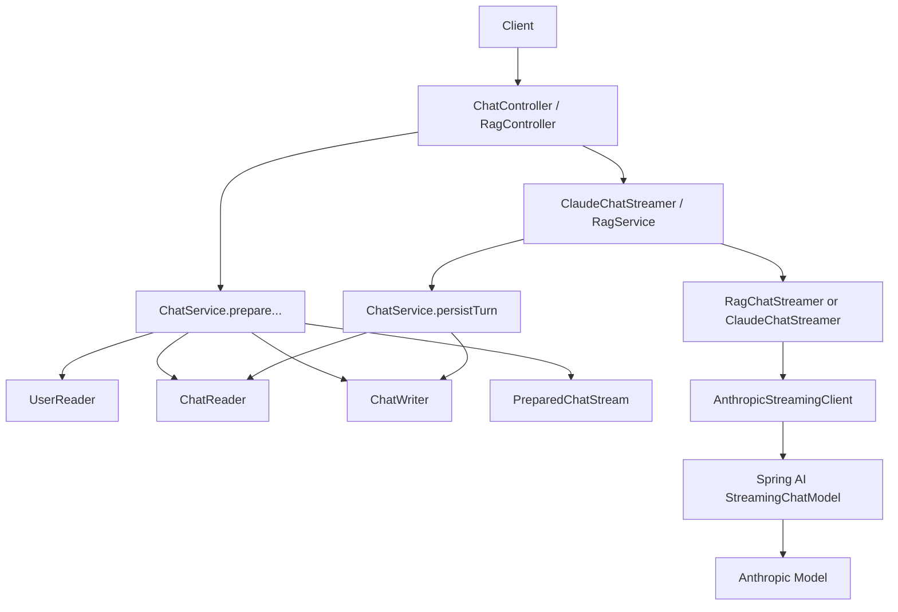

# Chat Spring AI 전환 및 대화 영속화 작업 문서

## 1. 이번 작업에서 구현한 내용

### 1-1. LLM 호출 계층을 WebClient 직접 호출에서 Spring AI 기반으로 전환
- `shared/llm/AnthropicStreamingClient`가 더 이상 Anthropic SSE를 직접 파싱하지 않는다.
- `Spring AI`의 `StreamingChatModel`을 사용해 스트리밍 응답을 받도록 변경했다.
- 프로젝트 의존성도 직접 Anthropic SDK 선언 대신 `spring-ai-starter-model-anthropic`로 전환했다.
- 내부적으로 Anthropic Java SDK는 Spring AI가 사용하지만, 애플리케이션 코드에서는 직접 SDK 타입을 사용하지 않는다.

### 1-2. Chat 도메인 엔티티 추가
- `domain/chat/entity/Chat`
- `domain/chat/entity/ChatMessage`
- 사용자의 direct chat / rag chat 세션과 각 메시지 턴을 DB에 저장할 수 있게 만들었다.

### 1-3. 채팅 이력 저장/이어가기 구현
- `ChatStreamRequest`, `RagChatRequest`에 `chatPublicId`를 추가했다.
- direct chat (`/v1/chat/stream`)와 rag chat (`/v1/rag/chat`) 모두
  응답 헤더 `X-Chat-Public-Id`로 채팅 식별자를 반환한다.
- 이후 프론트가 같은 `chatPublicId`를 다시 보내면 서버가 DB에 저장된 이력을 기준으로 대화를 이어간다.

### 1-4. 채팅 조회 API 추가
- `GET /v1/chat`
- `GET /v1/chat/{publicId}`
- 로그인 사용자가 자신의 채팅 세션 목록/상세 이력을 조회할 수 있게 했다.

### 1-5. RAG 채팅도 동일한 영속화 흐름에 연결
- `RagService`가 `ChatService`를 사용해 RAG 대화 세션을 준비하고 턴을 저장하도록 연결했다.
- 즉, direct chat과 rag chat이 같은 `Chat` / `ChatMessage` 영속화 모델을 공유한다.

---

## 2. 설계 의도

### 2-1. 왜 Chat / ChatMessage 두 엔티티로 나눴는가
- 하나의 대화 세션(`Chat`)과 그 안의 개별 턴(`ChatMessage`)은 생명주기가 다르다.
- 세션 단위 목록 조회, 메시지 단위 상세 조회, 이어쓰기 처리 모두를 자연스럽게 지원하려면 분리하는 편이 맞다고 판단했다.

### 2-2. 왜 direct chat과 rag chat을 하나의 Chat 도메인에 저장했는가
- 저장해야 하는 본질은 “사용자와 모델의 대화 이력”이다.
- LLM 컨텍스트 생성 방식은 direct/rag로 다르지만, 세션/메시지 저장 구조는 동일하다.
- 그래서 `ChatType`으로 구분하고 저장 모델은 공통화했다.

### 2-3. 왜 `chatPublicId`를 요청 본문 + 응답 헤더로 처리했는가
- 스트리밍 응답은 `ApiResponse<T>`로 감싸기 어렵다.
- 따라서 서버가 생성한 세션 식별자를 응답 헤더로 보내고,
  이후 요청 본문에서 다시 받는 방식이 가장 단순하고 기존 스트리밍 구조를 덜 흔든다고 판단했다.

### 2-4. 왜 Spring AI starter를 사용했는가
- 사용자 요청대로 애플리케이션 코드에서 Anthropic Java SDK를 직접 다루지 않기 위해서다.
- 모델 호출은 Spring AI 추상화에 위임하고,
  우리 코드는 프롬프트/메시지 구성과 도메인 영속화에 집중하도록 정리했다.

---

## 3. 제대로 지시되지 않아 스스로 결정한 부분

1. **채팅 목록/상세 조회 API까지 함께 추가**
   - 단순 저장만 해두면 실제로 이력을 다시 불러오기 어렵다.
   - 그래서 실사용 가능한 수준으로 `GET /v1/chat`, `GET /v1/chat/{publicId}`도 함께 만들었다.

2. **기존 `anthropic.*` 설정은 유지하고 `spring.ai.anthropic.*`를 추가**
   - 기존 문서/환경 변수 흐름을 바로 깨지 않기 위해 유지했다.
   - 동시에 Spring AI 자동 구성용 표준 키도 추가했다.

3. **기존 채팅 이력과 새 메시지의 소스 오브 트루스는 DB로 결정**
   - `chatPublicId`가 주어진 경우에는 요청 `history`보다 DB에 저장된 메시지를 우선 사용한다.
   - 이유는 이어쓰기 시 중복 append를 방지하기 위해서다.

4. **새 채팅 생성 시 요청 history를 seed 데이터로 저장**
   - 프론트가 이미 들고 있던 과거 history를 서버 저장소로 이관할 수 있도록 했다.
   - 이를 통해 첫 저장 시점 이후에는 서버 쪽 이력 기준으로 전환할 수 있다.

---

## 4. 클래스 역할 정리

| 클래스 | 역할 |
|---|---|
| `Chat` | direct/rag 채팅 세션 메타데이터를 저장하는 루트 엔티티 |
| `ChatMessage` | 채팅 세션 내부의 개별 user/assistant 메시지를 저장하는 엔티티 |
| `ChatRepository` | 채팅 세션 조회/목록 조회용 JPA Repository |
| `ChatMessageRepository` | 채팅 메시지 정렬 조회 및 마지막 순서 계산용 Repository |
| `ChatReader` | 사용자 소유 채팅/메시지 조회 로직 담당 |
| `ChatWriter` | 채팅 생성, 메타데이터 갱신, 메시지 append 담당 |
| `ChatService` | direct chat 스트리밍 오케스트레이션 + 공통 채팅 세션 준비/저장/조회 담당 |
| `ClaudeChatStreamer` | direct chat용 시스템 프롬프트/메시지 조립 후 Spring AI 스트리밍 호출 |
| `RagChatStreamer` | RAG 컨텍스트 생성 + 디버그 블록 출력 + Spring AI 스트리밍 호출 |
| `AnthropicStreamingClient` | `StreamingChatModel`을 이용해 실제 토큰 스트림을 출력 스트림으로 전달 |
| `ChatMapper` | 엔티티 ↔ 응답 DTO / 내부 history 모델 변환 담당 |
| `ChatType` | direct / rag 채팅 구분 enum |
| `ChatHistoryMessage` | 저장된 과거 대화 내용을 LLM 프롬프트에 주입하기 위한 내부 모델 |
| `ChatMessageDraft` | append 직전 메시지 초안 모델 |

---

## 5. 클래스 간 논리 흐름도



---

## 6. 개발자가 알아둬야 하는 내용

### 6-1. 새/변경된 API
- `POST /v1/chat/stream`
  - 요청에 `chatPublicId` 선택적으로 포함 가능
  - 응답 헤더 `X-Chat-Public-Id` 반환
- `POST /v1/rag/chat`
  - 요청에 `chatPublicId` 선택적으로 포함 가능
  - 응답 헤더 `X-Chat-Public-Id` 반환
- `GET /v1/chat`
- `GET /v1/chat/{publicId}`

### 6-2. 프론트 연동 포인트
- 첫 스트리밍 호출 후 응답 헤더 `X-Chat-Public-Id`를 저장해야 한다.
- 후속 메시지부터는 같은 값을 `chatPublicId`로 보내면 된다.
- `chatPublicId`가 있으면 서버는 DB 이력을 기준으로 컨텍스트를 구성하므로,
  프론트가 중복 history를 계속 누적해서 보내지 않아도 된다.

### 6-3. DB 스키마 변화
- 신규 테이블
  - `tb_chat`
  - `tb_chat_message`
- 현재 `ddl-auto: update` 환경에서는 자동 반영된다.
- 운영 환경에서 별도 마이그레이션 툴(Flyway/Liquibase)을 도입했다면 그 스크립트도 추후 정식화하는 것이 좋다.

### 6-4. Spring AI 설정
현재 추가한 설정 키:
- `spring.ai.anthropic.api-key`
- `spring.ai.anthropic.base-url`
- `spring.ai.anthropic.chat.options.model`
- `spring.ai.anthropic.chat.options.max-tokens`

환경변수는 기존처럼 아래를 사용한다.
- `ANTHROPIC_API_KEY`

### 6-5. 주의 사항
- `Chat.updatedAt`이 새 메시지 append 때도 갱신되도록 `messageCount`를 증가시키는 방식으로 처리했다.
- `chatPublicId`가 다른 타입의 채팅에 재사용되면 `CHAT_002` 예외가 발생한다.
- direct chat / rag chat 모두 인증 사용자를 기준으로 자신의 채팅만 접근 가능하다.

---

## 7. 테스트 및 검증

실행한 검증:

```powershell
Set-Location "C:\Users\dksvl\Desktop\coding\IntelliJ\Jazzify"
.\gradlew.bat compileJava --no-daemon --stacktrace
.\gradlew.bat test --tests "*ChatServiceTest" --tests "*ClaudeChatStreamerTest" --tests "*RagChatStreamerTest" --tests "*RagServiceTest" --no-daemon --stacktrace
.\gradlew.bat test --no-daemon --stacktrace
```

결과:
- 메인 소스 컴파일 성공
- 새 `ChatServiceTest` 통과
- 기존 `ClaudeChatStreamerTest`, `RagChatStreamerTest`, `RagServiceTest` 통과
- 전체 테스트 통과

---

## 8. 한 줄 요약

이번 작업으로 Jazzify 백엔드는 이제
**Spring AI 기반 Anthropic 호출**로 전환되었고,
**direct chat / rag chat 대화 이력을 DB에 영속화하며 이어서 대화할 수 있는 구조**를 갖추게 되었다.

