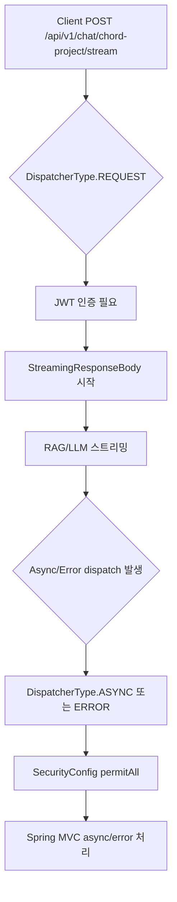

# 20260608-2207 Chord Project Chat Security Dispatcher Fix

## 작업한 내용

- `SecurityConfig`에 `DispatcherType.ASYNC`, `DispatcherType.ERROR`에 대한 `permitAll()` 규칙을 추가했다.
- `StreamingResponseBody` 기반 채팅 스트림에서 async/error dispatch가 다시 Spring Security 인증 규칙에 걸려 `AuthorizationDeniedException`이 발생하는 문제를 막았다.
- 회귀 테스트 `SecurityConfigTest`를 추가해 인증 없는 `ASYNC`, `ERROR` dispatcher 요청이 401/403으로 거부되지 않는지 확인했다.

## 설계 의도

- 최초 `REQUEST` dispatcher의 API 요청은 기존처럼 JWT 인증을 요구한다.
- 이미 인증을 통과해 시작된 스트리밍 응답의 `ASYNC` dispatch와, 응답 커밋 이후 예외 처리 중 발생하는 `ERROR` dispatch만 보안 인증 대상에서 제외한다.
- `/v1/chat/chord-project/stream` 자체를 공개하지 않고 dispatcher type 기준으로만 예외 처리해서 인증 범위를 넓히지 않는다.

## 임의로 결정한 부분

- Swagger 명세는 수정하지 않았다. 외부 API 경로, 요청/응답 스키마, 상태 코드 계약을 변경하지 않고 Spring Security 내부 dispatcher 처리만 변경했기 때문이다.
- 테스트는 실제 채팅 스트림을 호출하지 않고 보호 대상 미등록 경로를 `ASYNC`/`ERROR` dispatcher로 요청했다. 보안 필터가 막으면 401/403이 되며, 통과하면 현재 전역 예외 처리 정책상 500이 된다.

## 개발자가 알아둬야 할 내용

- 로그의 `Unable to handle the Spring Security Exception because the response is already committed`는 스트리밍 응답 일부가 이미 클라이언트에 전달된 뒤 Spring Security 예외 처리를 시도해서 발생한다.
- 이번 변경은 응답 커밋 이후 `/error` dispatch가 인증 문제로 다시 실패하는 2차 예외를 방지한다.
- 원래 스트림 처리 중 발생한 LLM/RAG 예외 자체를 모두 복구하는 변경은 아니다. 스트림 내부 예외를 사용자에게 텍스트로 전달해야 한다면 별도 스트리밍 에러 프로토콜이 필요하다.

## 생성/변경 클래스

| 클래스 | 구분 | 역할 |
| --- | --- | --- |
| `SecurityConfig` | 변경 | `ASYNC`, `ERROR` dispatcher를 인증 예외로 허용해 스트리밍 async/error dispatch가 보안 필터에서 거부되지 않게 한다. |
| `SecurityConfigTest` | 생성 | dispatcher type 예외 규칙이 동작해 인증 없는 async/error dispatch가 401/403으로 차단되지 않는지 검증한다. |

## 논리 흐름도



## 검증

```bash
.\gradlew.bat test --tests "com.jazzify.backend.core.security.SecurityConfigTest" --tests "com.jazzify.backend.domain.chat.*" --tests "com.jazzify.backend.domain.rag.service.implementation.RagChatStreamerTest"
```

- 결과: 성공
