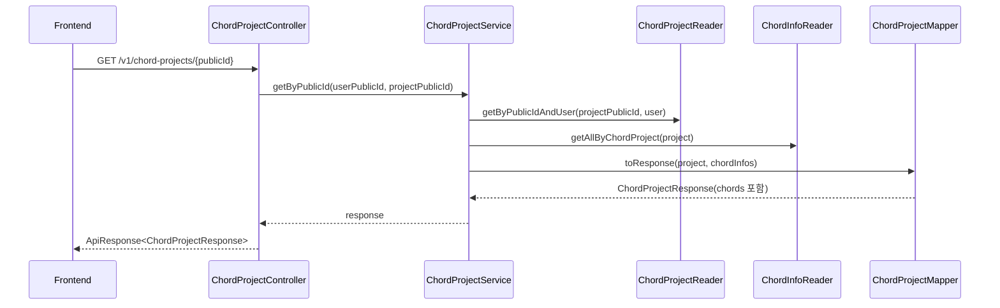

# ChordProject 단건 조회 chord-info 응답 포함

## 작업 내용

ChordProject 단건 조회 API가 프로젝트 메타데이터와 함께 저장된 `ChordInfo` 목록을 응답하도록 수정했다.

```text
GET /api/v1/chord-projects/{publicId}
```

응답 DTO `ChordProjectResponse`에 `chords` 필드를 추가했고, 단건 조회 서비스에서 `ChordInfoReader.getAllByChordProject(project)`로 bar/beat 정렬된 코드 정보를 조회해 채운다.

## 설계 의도

수정 범위를 단건 조회에 한정했다. `ChordProjectResponse`는 목록 조회, 생성, 수정 응답에서도 재사용되고 있으므로 DTO에는 `chords` 필드를 추가하되 기본 mapper는 빈 배열을 반환하게 했다. 단건 조회에서만 mapper overload를 사용해 실제 chord-info를 포함한다.

이 방식은 기존 목록 조회의 payload 증가를 막고, 사용자가 요청한 단건 조회 API의 정보 밀도만 높인다.

## 클래스 역할

새 클래스를 만들지는 않았다.

| 클래스 | 역할 |
| --- | --- |
| `ChordProjectResponse` | 프로젝트 응답에 `List<ChordInfoResponse> chords` 필드 추가 |
| `ChordProjectMapper` | 기본 응답은 빈 `chords`, 단건 조회용 overload는 실제 `ChordInfo`를 `ChordInfoResponse`로 변환 |
| `ChordProjectService` | 단건 조회 시 프로젝트 소유권 확인 후 chord-info를 함께 조회 |
| `ChordProjectControllerSpec` | Swagger 설명에 단건 조회 응답의 `chords` 포함 사실 명시 |

## 논리 흐름도



## 임의로 결정한 부분

목록 조회, OMR 생성 응답, 수정 응답에도 같은 `ChordProjectResponse`가 사용되므로 해당 응답들에는 `chords: []`가 포함된다. 단건 조회 외 API에서 chord-info를 같이 내려주면 목록 조회 payload가 커질 수 있어 요청 범위를 넘는 변경으로 판단했다.

## 개발자가 알아둬야 할 내용

- `chords`는 `ChordInfoReader`의 기존 정렬 기준인 bar asc, beat asc 순서로 내려간다.
- 기존 클라이언트가 `ChordProjectResponse`를 엄격한 schema로 파싱한다면 새 `chords` 필드가 추가된다.
- 생성 직후 또는 OMR 처리 중인 프로젝트는 아직 코드가 없을 수 있으므로 `chords`가 빈 배열일 수 있다.

## 검증

다음 명령을 실행했다.

```text
./gradlew.bat compileJava
```

결과: 성공.
