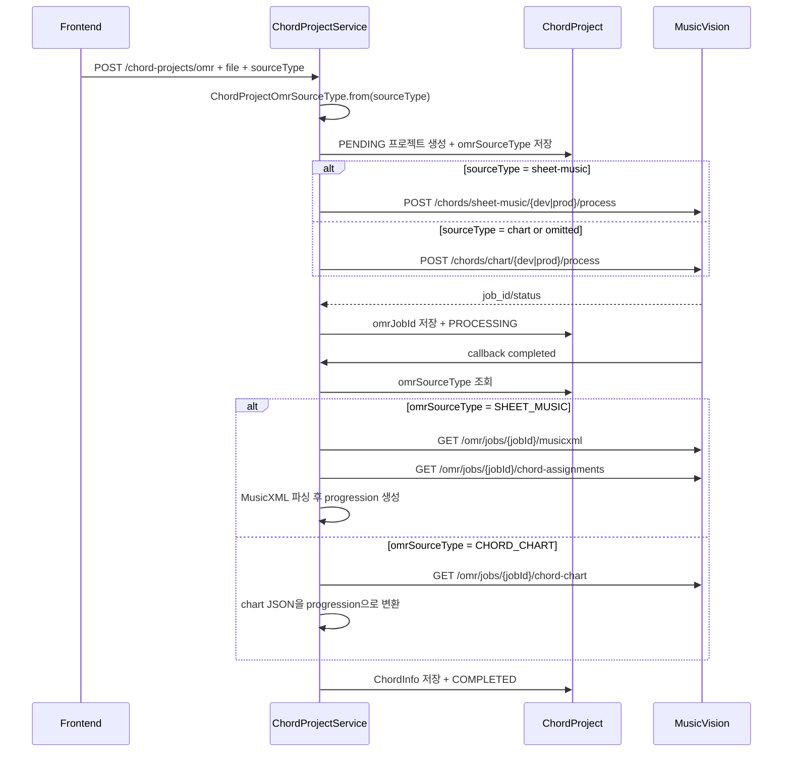

# ChordProject OMR sourceType 라우팅 변경

## 작업 내용

ChordProject OMR 생성 API에 `sourceType` form parameter를 추가했다.

```text
POST /api/v1/chord-projects/omr
Content-Type: multipart/form-data

file=<png|jpg|jpeg>
sourceType=chart | chord-chart | sheet | sheet-music
```

- `sourceType` 미입력: 기존 동작 유지를 위해 `CHORD_CHART`로 처리
- `chart`, `chord-chart`, `chord_chart`, `CHORD_CHART`: `/chords/chart/{dev|prod}/process` 호출
- `sheet`, `sheet-music`, `sheet_music`, `SHEET_MUSIC`: `/chords/sheet-music/{dev|prod}/process` 호출
- 두 경로 모두 기존 `omr.api-key` 값을 사용하여 `X-OMR-API-Key` 헤더를 붙인다.

## 설계 의도

기존 ChordProject OMR은 항상 chord-chart 전용 endpoint로 제출하고, 콜백 이후에도 `/omr/jobs/{jobId}/chord-chart` 결과만 조회했다.

이번 변경에서는 업로드 이미지가 일반 악보인지 코드 차트인지에 따라 제출 endpoint와 콜백 결과 처리 방식을 함께 분기했다. 제출만 분기하면 일반 악보 작업 완료 후에도 chord-chart 결과를 조회하게 되어 실패할 수 있기 때문이다.

선택한 `sourceType`은 `ChordProject.omrSourceType` 컬럼에 저장한다. OMR 서버 콜백에는 원 요청의 form field가 다시 오지 않으므로, 콜백 처리 시점에 어떤 결과 조회 방식을 써야 하는지 알기 위한 최소 상태 저장이다. 기존 데이터의 `omrSourceType`이 null인 경우에는 과거 동작과 동일하게 `CHORD_CHART`로 간주한다.

## 클래스 역할

| 클래스 | 역할 |
| --- | --- |
| `ChordProjectOmrCreateRequest` | multipart form metadata에 `sourceType`을 받는 요청 DTO |
| `ChordProjectOmrSourceType` | `sourceType` 문자열 alias를 `SHEET_MUSIC` 또는 `CHORD_CHART`로 파싱 |
| `ChordProject` | OMR 콜백 처리를 위해 선택된 `omrSourceType` 저장 |
| `ChordProjectOmrWriter` | pending ChordProject 생성 시 `omrSourceType` 저장 |
| `ChordProjectService` | 요청 `sourceType` 파싱, OMR 제출 endpoint 선택, 콜백 처리 시 결과 처리 방식 선택 |
| `ChordProjectOmrProcessor` | `CHORD_CHART`는 chord-chart JSON, `SHEET_MUSIC`은 MusicXML + chord assignments를 progression으로 변환 |
| `OmrClient` | `/chords/chart/...`와 `/chords/sheet-music/...` 제출 메서드 제공 |

## 논리 흐름도



## 임의로 결정한 부분

첨부된 `docs/spring_boot_backend.md`는 일반 악보 업로드를 `/omr/{dev|prod}/process`로 설명한다. 하지만 이번 요청 조건에는 ChordProject OMR에서 `chords/sheet-music/...` 또는 `chords/chart/...`를 호출하라고 되어 있어, ChordProject의 일반 악보 경로는 `/chords/sheet-music/{dev|prod}/process`로 구현했다.

또한 기존 프론트엔드 호출을 깨지 않기 위해 `sourceType` 기본값은 `chart`로 두었다.

## 개발자가 알아둬야 할 내용

- `tb_chord_project`에 `omr_source_type` 컬럼이 추가된다. 현재 JPA 설정은 dev/prod 모두 `ddl-auto=update`라 자동 반영될 수 있지만, 운영 DB 정책상 수동 마이그레이션을 쓰는 경우 nullable `VARCHAR(30)` 컬럼을 추가해야 한다.
- `sourceType` 값이 지원 alias가 아니면 `CHORD_PROJECT_007` 에러가 발생한다.
- sheet-music 결과 처리는 `SheetProjectOmrProcessor`에 의존하지 않고 ChordProject 내부에서 처리한다. 도메인 implementation 계층 간 직접 의존을 피하기 위해서다.
- `/chords/sheet-music/{dev|prod}/process`가 MusicVision에 실제 배포되어 있어야 한다. 이 endpoint도 기존과 동일한 `X-OMR-API-Key`를 사용한다.

## 검증

다음 테스트를 실행했다.

```text
./gradlew.bat test --tests "com.jazzify.backend.shared.omr.OmrClientTest" --tests "com.jazzify.backend.domain.chordproject.service.implementation.ChordProjectOmrProcessorTest"
```

결과: 성공.
