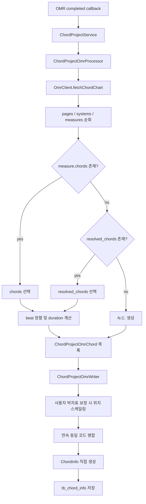

# ChordProject OMR 구조화 코드 저장 전면 수정

작성일: 2026-06-06

## 작업 내용

ChordProject OMR 결과를 progression 문자열로 축약한 뒤 다시 파싱하던 저장 방식을 제거했다.

기존 방식은 다음 문제가 있었다.

- `chart_ocr.accepted_tokens`의 중복 OCR 후보와 ending marker가 실제 코드로 저장될 수 있었다.
- `%` 반복 마디의 `resolved_chords`를 읽지 않아 `N.C.` 또는 잘못된 문자열이 저장됐다.
- OMR이 제공한 `beat`가 사라지고 코드 개수에 따라 박자가 재분배됐다.
- OMR 응답의 제목이 무시되고 `Untitled`이 사용됐다.

수정 후에는 `pages[].systems[].measures[]`의 구조화 데이터를 읽어 코드별 마디, 시작 박자, 지속 박자를 유지한 채 `ChordInfo`로 직접 저장한다.

## 파싱 우선순위

마디별 저장 소스는 다음 순서로 결정한다.

1. `measure.chords`
2. `measure.chords`가 비어 있으면 `measure.resolved_chords`
3. 둘 다 비어 있으면 해당 마디를 `N.C.`로 저장

`chart_ocr.accepted_tokens`는 OCR 중간 후보 집합이므로 저장 소스로 사용하지 않는다.

## 설계 의도

### 구조화 정보 보존

OMR 응답에 이미 `measure.index`, `chord.beat`, `resolved_chords`가 있으므로 이를 progression 문자열로 변환하지 않는다. 문자열 변환 과정에서 발생하던 박자 및 반복 마디 정보 손실을 차단했다.

### 지속 박자 계산

코드의 지속 박자는 다음 코드의 시작 박자까지로 계산한다. 마지막 코드는 마디 끝까지 지속한다.

예를 들어 4/4 마디에 코드가 beat 1과 beat 3에 있으면 다음과 같이 저장한다.

| 코드 | beat | durationBeats |
| --- | ---: | ---: |
| 첫 번째 코드 | 1 | 2 |
| 두 번째 코드 | 3 | 2 |

beat 3에 코드 하나만 있으면 `beat=3`, `durationBeats=2`로 저장한다.

### 박자표 사용자 보정

사용자가 OMR 생성 요청에서 박자표를 직접 지정했고 OMR의 `beats_per_bar`와 다르면 코드 위치를 새 박자 길이에 비례해 조정한다.

예를 들어 4박 기준 beat 3은 3박 기준 beat 2.5로 조정된다.

### 동일 코드 병합

같은 마디에서 동일 코드가 끊김 없이 이어지면 기존 `IRealProChordParser` 동작과 동일하게 하나의 `ChordInfo`로 병합한다.

## 클래스 역할

| 클래스/record | 역할 |
| --- | --- |
| `OmrClient` | chord-chart JSON을 구조화된 코드 위치 목록으로 파싱한다. `chords`, `resolved_chords`, 제목, 박자표를 처리한다. |
| `OmrClient.ChordChartResult` | OMR 제목, 박자표, 마디당 박수, 코드 위치 목록을 전달한다. |
| `OmrClient.ChordChartChord` | 공유 OMR 계층에서 코드 하나의 bar, beat, duration을 표현한다. |
| `ChordProjectOmrChord` | ChordProject 도메인 내부에서 저장할 OMR 코드 위치를 표현한다. |
| `ChordProjectOmrProcessor` | chord-chart 또는 sheet-music OMR 결과를 `ChordProjectOmrChord` 목록으로 통일한다. |
| `ChordProjectOmrWriter` | 구조화 코드 목록을 `ChordInfo` 엔티티로 직접 변환하고 저장한다. |
| `ChordProjectService` | 콜백 완료 시 사용자 보정 메타데이터와 구조화 OMR 결과를 Writer에 전달한다. |
| `ChordProjectOmrWriterTest` | 직접 저장 시 bar, beat, duration, sortOrder와 박자표 스케일링을 검증한다. |

## 클래스 간 논리 흐름도



## 임의로 결정한 부분

- `accepted_tokens`는 실제 응답에서 같은 셀의 상충 후보와 ending marker를 포함하므로 저장 경로에서 완전히 제외했다.
- 동일 beat에 서로 다른 코드가 여러 개 있으면 confidence가 높은 구조화 코드를 선택한다.
- beat가 없으면 마디 안 코드 개수에 따라 균등한 위치를 추론한다.
- beat가 마디 범위를 벗어나면 1부터 `beats_per_bar` 사이로 제한한다.
- 코드가 없는 마디도 bar 번호 유지를 위해 chord가 null인 `ChordInfo`로 저장한다.
- OMR 응답의 `composer`, `style`, section/ending/navigation 정보는 현재 `ChordProject` 및 `ChordInfo` 저장 필드가 없어 저장하지 않는다.

## 개발자가 알아둬야 할 내용

- ChordProject OMR 저장은 더 이상 `IRealProChordParser`를 거치지 않는다.
- 수동 코드 입력 API의 progression 문자열 파싱은 기존 `IRealProChordParser`를 계속 사용한다.
- SheetProject OMR 저장 경로는 변경하지 않았다.
- ChordProject의 sheet-music 입력 유형은 Processor에서 구조화 목록으로 변환한 뒤 동일 Writer를 사용한다.
- 원본 OMR JSON은 여전히 DB에 저장하지 않는다.
- API 요청 및 응답 형식은 변경하지 않았으므로 Swagger 명세 변경은 없다.

## 검증

다음 항목을 테스트에 추가했다.

- `accepted_tokens`의 중복 코드 및 ending marker 무시
- `%` 반복 마디의 `resolved_chords` 저장
- 빈 마디의 `N.C.` 저장
- beat 1/3 코드의 duration 2/2 계산
- beat 3 단일 코드의 위치 보존
- 연속 동일 코드 병합
- OMR 제목 적용
- 사용자 박자표 덮어쓰기 시 위치 스케일링
- chord-chart와 sheet-music ChordProject OMR의 구조화 변환

전체 테스트:

```text
./gradlew.bat test
```

결과: 성공.
