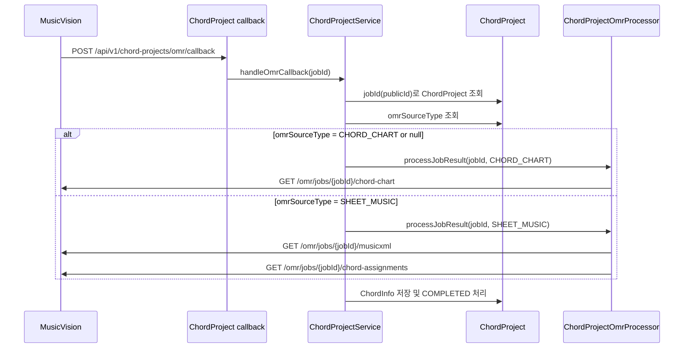

# ChordProject OMR callback 통합 롤백

## 작업 내용

ChordProject OMR에서 chord-chart 전용 callback API를 별도로 두는 방향을 되돌리고, callback endpoint를 다시 하나로 통합했다.

```text
POST /api/v1/chord-projects/omr/callback
```

OMR 작업 제출은 입력 `sourceType`에 따라 계속 분기한다.

| sourceType | 제출 API | callback API | 완료 후 결과 조회 API |
| --- | --- | --- | --- |
| `chart`, `chord-chart`, 미입력 | `/chords/chart/{dev|prod}/process` | `/api/v1/chord-projects/omr/callback` | `GET /omr/jobs/{jobId}/chord-chart` |
| `sheet`, `sheet-music` | `/chords/sheet-music/{dev|prod}/process` | `/api/v1/chord-projects/omr/callback` | `GET /omr/jobs/{jobId}/musicxml`, `GET /omr/jobs/{jobId}/chord-assignments` |

## 설계 의도

callback URL을 여러 개로 나누지 않고, `ChordProject.omrSourceType`에 저장된 원 요청 유형으로 완료 후 결과 조회 API만 다르게 선택한다. OMR callback payload에는 최초 요청의 `sourceType`이 다시 포함되지 않으므로, DB에 저장된 `omrSourceType`이 callback 처리의 기준이 된다.

`omrSourceType`이 없는 기존 데이터는 과거 기본 동작과 맞추기 위해 `CHORD_CHART`로 처리한다.

## MusicXML 조회 여부

Chord-chart OMR 경로에서는 MusicXML을 조회하지 않는다.

- `CHORD_CHART`: `OmrClient.fetchChordChart(jobId)`만 호출한다.
- `SHEET_MUSIC`: `OmrClient.fetchMusicXml(jobId)`와 `OmrClient.fetchChordAssignments(jobId)`를 호출한다.

MusicXML은 일반 악보 OMR에서 chord assignments를 실제 악보의 마디 구조, 제목, 조성, 박자 정보와 맞춰 progression으로 변환하기 위해서만 필요하다. chord-chart 결과는 이미 코드 진행과 박자 정보가 JSON으로 제공되므로 MusicXML을 가져올 이유가 없다.

## 클래스 역할

새 클래스를 만들지는 않았다.

| 클래스 | 역할 |
| --- | --- |
| `ChordProjectOmrCallbackController` | 단일 callback endpoint `/callback` 수신 |
| `ChordProjectService` | callback 수신 후 `ChordProject.omrSourceType`을 읽어 결과 조회 방식 선택 |
| `ChordProjectOmrProcessor` | `CHORD_CHART`와 `SHEET_MUSIC` 처리 경로를 분리하여 OMR 결과를 progression으로 변환 |
| `OmrCallbackDomain` | ChordProject callback path를 단일 path로 유지 |

## 논리 흐름도



## 임의로 결정한 부분

별도 chord-chart callback API를 제거하고 기존 단일 callback API만 유지했다. callback을 분리하지 않아도 `omrSourceType` 저장값으로 결과 조회 API를 안정적으로 선택할 수 있기 때문이다.

## 개발자가 알아둬야 할 내용

- chord-chart OMR 완료 callback에서 MusicXML 조회가 발생하면 의도와 다른 동작이다. 해당 경로는 `/omr/jobs/{jobId}/chord-chart`만 사용해야 한다.
- sheet-music OMR은 코드 정보만 최종 저장하더라도 MusicXML 파싱이 필요하다. chord assignments만으로는 기존 파서가 사용하는 제목, 조성, 박자, 마디 순서 정렬 정보를 충분히 만들 수 없기 때문이다.
- Swagger 설명도 단일 callback URL과 sourceType별 결과 조회 API를 기준으로 유지해야 한다.

## 검증

다음 테스트를 실행했다.

```text
./gradlew.bat test --tests "com.jazzify.backend.domain.chordproject.service.implementation.ChordProjectOmrProcessorTest" --tests "com.jazzify.backend.shared.omr.OmrClientTest"
```

결과: 성공.
