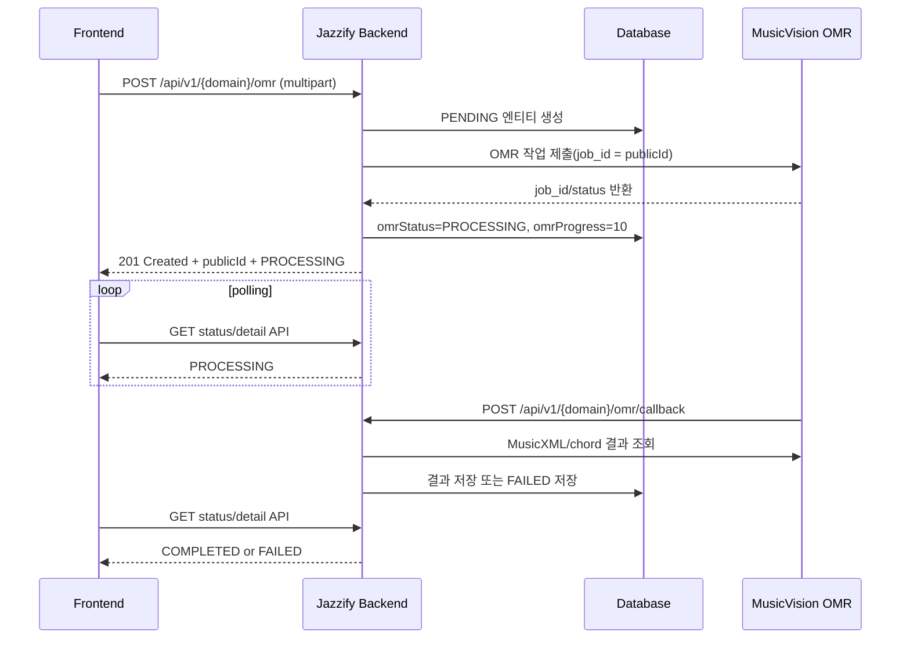

# OMR 비동기 처리 프론트엔드 연동 가이드

## 목적

ChordProject, SheetProject, Lick, Solo의 OMR 업로드 API는 파일을 업로드한 HTTP 요청 안에서 최종 인식 결과를 만들지 않는다. 백엔드는 먼저 임시 엔티티를 만들고 OMR 서버에 작업을 제출한 뒤, OMR 서버 콜백을 받아 최종 데이터를 채운다.

이 문서는 프론트엔드 개발자가 업로드, 진행 상태 표시, 완료/실패 처리, 후속 조회를 구현할 수 있도록 현재 백엔드 구현 기준의 계약을 정리한다.

작성 기준 코드:

- `ChordProjectService`, `SheetProjectService`, `LickService`, `SoloService`
- 각 도메인의 `*Controller`, `*OmrCallbackController`
- `OmrClient`, `OmrProcessingStatus`, `OmrCallbackDomain`
- 각 도메인의 OMR 요청/응답 DTO와 Writer

## 한 줄 요약

프론트엔드는 `POST /api/v1/{domain}/omr` 응답을 "완료 결과"로 취급하면 안 된다. 응답의 `publicId`를 저장하고 `omrStatus`가 `COMPLETED` 또는 `FAILED`가 될 때까지 폴링해야 한다.

## 공통 계약

### Base URL

현재 dev/prod 설정 모두 `server.servlet.context-path: /api`를 사용한다.

프론트엔드에서 직접 호출하는 경로는 일반적으로 다음처럼 `/api`를 포함한다.

```text
/api/v1/chord-projects/omr
/api/v1/sheet-projects/omr
/api/v1/licks/omr
/api/v1/solos/omr
```

프록시나 API gateway가 `/api`를 제거해서 백엔드로 전달하는 구조라면 프론트엔드 내부 상수에서만 조정한다. 컨트롤러 자체의 매핑은 `/v1/...`이다.

### 인증

OMR 생성/조회 API는 일반 사용자 API로 취급한다.

- `Authorization: Bearer <accessToken>` 필요
- OMR 서버가 호출하는 내부 callback API만 JWT 없이 열려 있다.

### 업로드 형식

모든 OMR 생성 API는 `multipart/form-data`를 사용한다.

- 필수 파일 파트명: `file`
- 허용 확장자: `png`, `jpg`, `jpeg`
- 빈 파일은 거부된다.
- 현재 Spring multipart 설정 기준 최대 파일 크기: `20MB`, 전체 요청 크기: `25MB`

### 응답 래퍼

성공 응답은 항상 `data`로 감싼다.

```json
{
  "data": {
    "...": "..."
  }
}
```

에러 응답은 다음 구조다.

```json
{
  "code": "OMR_004",
  "message": "지원하지 않는 파일 형식입니다. PNG, JPG, JPEG만 허용합니다.",
  "detail": "score.pdf"
}
```

### 상태 값

`omrStatus` 또는 status 조회 API의 `status`는 다음 enum 중 하나다.

| 상태 | 의미 | 프론트엔드 처리 |
| --- | --- | --- |
| `PENDING` | 백엔드에 임시 엔티티가 생성됨 | 보통 업로드 요청 중 내부 상태라 화면에서 짧게만 보일 수 있음 |
| `PROCESSING` | OMR 서버에 작업 제출 완료, 처리 중 | 진행 UI 표시 및 폴링 계속 |
| `COMPLETED` | OMR 결과 반영 완료 | 폴링 중단, 상세 데이터 재조회/화면 전환 |
| `FAILED` | OMR 처리 또는 결과 반영 실패 | 폴링 중단, `failureReason`/`omrFailureReason` 표시 |

현재 진행률은 세밀한 실시간 값이 아니다.

- 생성 직후 내부 상태: `PENDING`, `0`
- OMR 서버 제출 성공 후 프론트엔드가 받는 일반적인 응답: `PROCESSING`, `10`
- OMR 완료 콜백 처리 중: `PROCESSING`, `80`
- 완료: `COMPLETED`, `100`
- 실패: `FAILED`, 실패 지점에 따라 `0` 또는 `80`

따라서 UI는 `progress` 숫자보다 `status` 중심으로 설계하는 것이 안전하다.

## 전체 흐름



## 프론트엔드 권장 구현

1. 사용자가 파일과 metadata를 입력한다.
2. `FormData`로 `POST /api/v1/{domain}/omr`를 호출한다.
3. 성공 응답에서 `publicId`와 초기 `omrStatus`를 저장한다.
4. `PROCESSING`이면 2~3초 간격으로 폴링한다.
5. `COMPLETED`이면 폴링을 멈추고 상세 API를 다시 조회한다.
6. `FAILED`이면 폴링을 멈추고 실패 메시지를 보여준다.
7. 업로드 요청 자체가 4xx/5xx로 실패하면 poll 대상 `publicId`를 못 받을 수 있으므로 즉시 에러 UI로 처리한다.

권장 UI 상태:

| FE 상태 | 조건 |
| --- | --- |
| `uploading` | `POST /omr` 요청 중 |
| `processing` | 응답 또는 폴링 결과가 `PENDING`/`PROCESSING` |
| `completed` | `COMPLETED` |
| `failed` | `FAILED` 또는 업로드 요청 실패 |

## 도메인별 API 요약

| 도메인 | 생성 API | 상태 확인 API | 완료 후 데이터 조회 |
| --- | --- | --- | --- |
| ChordProject | `POST /api/v1/chord-projects/omr` | `GET /api/v1/chord-projects/{publicId}/omr-status` | `GET /api/v1/chord-projects/{publicId}` |
| SheetProject | `POST /api/v1/sheet-projects/omr` | `GET /api/v1/sheet-projects/{publicId}/omr-status` | `GET /api/v1/sheet-projects/{publicId}` |
| Lick | `POST /api/v1/licks/omr` | 전용 status API 없음. `GET /api/v1/licks/{publicId}`의 `omrStatus` 확인 | `GET /api/v1/licks/{publicId}` |
| Solo | `POST /api/v1/solos/omr` | 전용 status API 없음. `GET /api/v1/solos/{publicId}`의 `omrStatus` 확인 | `GET /api/v1/solos/{publicId}` |

## ChordProject

### 생성 요청

```http
POST /api/v1/chord-projects/omr
Content-Type: multipart/form-data
Authorization: Bearer <accessToken>
```

Form fields:

| 필드 | 필수 | 설명 |
| --- | --- | --- |
| `file` | 예 | PNG/JPG/JPEG 악보 이미지 |
| `title` | 아니오 | 완료 시 사용자 입력값, OMR 제목, `Untitled` 순으로 적용 |
| `key` | 아니오 | `MusicKey` enum 이름. 예: `C_MAJOR`, `B_FLAT_MAJOR`, `C_MINOR` |
| `timeSignature` | 아니오 | 예: `4/4`. 미입력 시 임시값 `4/4` |

ChordProject는 코드 차트 전용 OMR endpoint를 사용한다.

- dev profile: OMR 서버의 `/chords/chart/dev/process`
- prod profile: OMR 서버의 `/chords/chart/prod/process`

### 생성 응답

정상적으로 OMR 서버 제출까지 성공하면 보통 `PROCESSING`, `10` 상태로 응답한다.

```json
{
  "data": {
    "project": {
      "publicId": "1c6044f1-f6c5-4f95-9b1f-7ed384c8f7d8",
      "title": "Autumn Leaves",
      "keySignature": "C_MAJOR",
      "timeSignature": "4/4",
      "omrStatus": "PROCESSING",
      "omrProgress": 10,
      "omrFailureReason": null,
      "createdAt": "2026-06-04T15:00:00",
      "updatedAt": "2026-06-04T15:00:01"
    },
    "chords": []
  }
}
```

`chords`는 생성 직후 비어 있다. 실제 chord 저장은 OMR 완료 콜백 이후 수행된다.

### 상태 조회

```http
GET /api/v1/chord-projects/{publicId}/omr-status
Authorization: Bearer <accessToken>
```

```json
{
  "data": {
    "publicId": "1c6044f1-f6c5-4f95-9b1f-7ed384c8f7d8",
    "status": "COMPLETED",
    "progress": 100,
    "failureReason": null
  }
}
```

### 완료 후 주의사항

OMR 완료 시 백엔드는 인식한 progression을 `ChordInfo`로 저장하고 프로젝트의 제목, 조성, 박자를 확정한다.

현재 컨트롤러에는 완료된 `ChordInfo` 목록만 조회하는 전용 `GET /chords` API가 없다. 프론트엔드가 완료 직후 인식된 코드 목록을 표/편집 UI로 보여줘야 한다면 별도 조회 API가 필요하다. 현재 공개 API만 사용하면 프로젝트 metadata/status는 `GET /api/v1/chord-projects/{publicId}`로 확인할 수 있다.

## SheetProject

### 생성 요청

```http
POST /api/v1/sheet-projects/omr
Content-Type: multipart/form-data
Authorization: Bearer <accessToken>
```

Form fields:

| 필드 | 필수 | 설명 |
| --- | --- | --- |
| `file` | 예 | PNG/JPG/JPEG 악보 이미지 |
| `title` | 아니오 | 미입력 시 임시 제목 `OMR Processing` |
| `key` | 아니오 | `MusicKey` enum 이름. 예: `C_MAJOR`, `B_FLAT_MAJOR`, `C_MINOR` |

SheetProject는 일반 악보 OMR endpoint를 사용한다.

- dev profile: OMR 서버의 `/omr/dev/process`
- prod profile: OMR 서버의 `/omr/prod/process`

### 생성 응답

```json
{
  "data": {
    "project": {
      "publicId": "0c7344c6-97a8-448d-bf6f-a9ad8ad8363f",
      "title": "OMR Processing",
      "keySignature": null,
      "filePublicId": "4e3e840d-7596-4217-bf26-2dc87b30d912",
      "omrStatus": "PROCESSING",
      "omrProgress": 10,
      "omrFailureReason": null,
      "createdAt": "2026-06-04T15:00:00",
      "updatedAt": "2026-06-04T15:00:01"
    },
    "chords": []
  }
}
```

SheetProject는 업로드 파일을 `StorageFile`/`SheetFile`에 먼저 연결하므로 생성 응답에 `filePublicId`가 포함된다.

### 상태 조회

```http
GET /api/v1/sheet-projects/{publicId}/omr-status
Authorization: Bearer <accessToken>
```

```json
{
  "data": {
    "publicId": "0c7344c6-97a8-448d-bf6f-a9ad8ad8363f",
    "status": "PROCESSING",
    "progress": 10,
    "failureReason": null
  }
}
```

### 완료 후 주의사항

OMR 완료 시 백엔드는 제목, 조성, 코드 progression을 반영하고 관련 `ChordInfo`를 저장한다.

ChordProject와 마찬가지로 현재 SheetProject 컨트롤러에는 저장된 chord 목록만 조회하는 전용 API가 없다. 프로젝트 metadata/status는 `GET /api/v1/sheet-projects/{publicId}`로 확인한다.

## Lick

### 생성 요청

```http
POST /api/v1/licks/omr
Content-Type: multipart/form-data
Authorization: Bearer <accessToken>
```

Form fields:

| 필드 | 필수 | 설명 |
| --- | --- | --- |
| `file` | 예 | PNG/JPG/JPEG 악보 이미지 |
| `title` | 아니오 | 미입력 시 임시 제목 `OMR Processing`, 완료 후 MusicXML 제목 사용 |
| `performer` | 아니오 | 미입력 시 `Unknown`으로 저장 |
| `composer` | 아니오 | 미입력 시 `Unknown`으로 저장하되, 완료 시 MusicXML composer fallback 허용 |
| `album` | 아니오 | 앨범명 |
| `source` | 아니오 | `user`, `weimar`, `curated`. 미입력/알 수 없는 값은 현재 구현상 `unknown` |
| `instrument` | 아니오 | `as`, `ts`, `tp`, `p`, `g`, `b`, `voc`, `cl`. 미입력/알 수 없는 값은 `unknown` |
| `style` | 아니오 | `SWING`, `BEBOP`, `HARDBOP`, `COOL`, `MODAL`, `FUSION` |
| `tempo` | 아니오 | 1~500 |
| `key` | 아니오 | Weimar 스타일 문자열. 예: `Bb-maj`, `C-min` |
| `timeSignature` | 아니오 | 예: `4/4` |
| `rhythmFeel` | 아니오 | `SWING`, `STRAIGHT`, `BOSSA`, `LATIN` |
| `userId` | 아니오 | UUID 문자열. 잘못된 UUID면 null 처리 |

### 생성 응답

Lick은 별도 OMR 생성 응답 DTO가 아니라 일반 `LickResponse`를 반환한다.

```json
{
  "data": {
    "publicId": "f2123f86-9577-4a09-a201-4472b8938cc2",
    "source": "user",
    "userId": null,
    "isOMR": true,
    "createdAt": "2026-06-04T15:00:00",
    "updatedAt": "2026-06-04T15:00:01",
    "omrStatus": "PROCESSING",
    "omrProgress": 10,
    "omrFailureReason": null,
    "performer": "Unknown",
    "composer": "Unknown",
    "title": "OMR Processing",
    "album": null,
    "instrument": "unknown",
    "style": null,
    "tempo": null,
    "key": null,
    "rhythmFeel": null,
    "timeSignature": null,
    "chords": null,
    "chordsPerNote": null,
    "harmonicContext": null,
    "targetChord": null,
    "sheetData": null,
    "nEvents": null,
    "pitches": null,
    "intervals": null,
    "parsons": null,
    "fuzzyIntervals": null,
    "durationClasses": null,
    "pitchMin": null,
    "pitchMax": null,
    "pitchRange": null,
    "pitchMean": null,
    "startPitch": null,
    "endPitch": null,
    "video": null
  }
}
```

### 상태 조회

전용 `/omr-status` API가 없다. 단건 조회로 상태를 확인한다.

```http
GET /api/v1/licks/{publicId}
Authorization: Bearer <accessToken>
```

응답의 `data.omrStatus`, `data.omrProgress`, `data.omrFailureReason`를 사용한다.

### 완료 후 데이터

`COMPLETED`가 되면 같은 단건 조회 응답에 다음 값들이 채워진다.

- `sheetData`
- `chords`, `chordsPerNote`
- `harmonicContext`, `targetChord`
- 유사도 feature 필드들: `nEvents`, `pitches`, `intervals` 등

## Solo

Solo OMR은 Lick OMR과 거의 같은 구조다.

### 생성 요청

```http
POST /api/v1/solos/omr
Content-Type: multipart/form-data
Authorization: Bearer <accessToken>
```

Form fields는 Lick과 동일하다.

Solo만의 차이:

- 사용자가 `title`을 보낸 경우, 생성 전에 `(title, performer)` 중복 검사를 수행한다.
- `title`을 보내지 않은 경우에는 임시 제목 중복 검사를 하지 않고, 완료 후 OMR/MusicXML 제목으로 확정한다.

### 상태 조회

전용 `/omr-status` API가 없다. 단건 조회로 상태를 확인한다.

```http
GET /api/v1/solos/{publicId}
Authorization: Bearer <accessToken>
```

응답의 `data.omrStatus`, `data.omrProgress`, `data.omrFailureReason`를 사용한다.

## 프론트엔드 polling 예시

```ts
type OmrStatus = 'PENDING' | 'PROCESSING' | 'COMPLETED' | 'FAILED';

type StatusResult = {
  status: OmrStatus;
  progress: number;
  failureReason?: string | null;
};

const sleep = (ms: number) => new Promise((resolve) => setTimeout(resolve, ms));

async function pollOmrStatus(
  fetchStatus: () => Promise<StatusResult>,
  options = { intervalMs: 2500, timeoutMs: 180000 }
) {
  const startedAt = Date.now();

  while (Date.now() - startedAt < options.timeoutMs) {
    const result = await fetchStatus();

    if (result.status === 'COMPLETED') return result;
    if (result.status === 'FAILED') {
      throw new Error(result.failureReason ?? 'OMR 처리에 실패했습니다.');
    }

    await sleep(options.intervalMs);
  }

  throw new Error('OMR 처리 시간이 초과되었습니다. 잠시 후 다시 확인해 주세요.');
}
```

ChordProject/SheetProject status fetch:

```ts
async function fetchProjectOmrStatus(kind: 'chord-projects' | 'sheet-projects', publicId: string) {
  const res = await fetch(`/api/v1/${kind}/${publicId}/omr-status`, {
    headers: { Authorization: `Bearer ${accessToken}` },
  });
  if (!res.ok) throw new Error(`status fetch failed: ${res.status}`);
  const json = await res.json();
  return {
    status: json.data.status,
    progress: json.data.progress,
    failureReason: json.data.failureReason,
  };
}
```

Lick/Solo status fetch:

```ts
async function fetchLibraryOmrStatus(kind: 'licks' | 'solos', publicId: string) {
  const res = await fetch(`/api/v1/${kind}/${publicId}`, {
    headers: { Authorization: `Bearer ${accessToken}` },
  });
  if (!res.ok) throw new Error(`detail fetch failed: ${res.status}`);
  const json = await res.json();
  return {
    status: json.data.omrStatus,
    progress: json.data.omrProgress,
    failureReason: json.data.omrFailureReason,
  };
}
```

## 내부 callback 정보

프론트엔드가 직접 호출하지 않는 내부 API다. OMR 서버가 작업 완료/실패 시 호출한다.

| 도메인 | OMR 서버 callback URL |
| --- | --- |
| ChordProject | `/api/v1/chord-projects/omr/callback` |
| SheetProject | `/api/v1/sheet-projects/omr/callback` |
| Lick | `/api/v1/licks/omr/callback` |
| Solo | `/api/v1/solos/omr/callback` |

OMR 서버는 `X-OMR-Callback-API-Key` 헤더를 보낸다. 백엔드는 `omr.callback-api-key`가 설정되어 있으면 이 값을 검증한다.

콜백 payload 예시:

```json
{
  "job_id": "f2123f86-9577-4a09-a201-4472b8938cc2",
  "status": "completed",
  "message": "OMR processing completed",
  "musicxml_path": "jobs/.../output/score.musicxml",
  "chord_assignments_path": "jobs/.../output/chord_assignments.json"
}
```

백엔드는 `job_id`를 각 도메인의 `publicId`로 사용한다. 그래서 callback이 오면 `job_id`를 UUID로 파싱해 엔티티를 찾아 업데이트한다.

## 에러 처리 가이드

주요 OMR 에러:

| 코드 | HTTP | 의미 |
| --- | --- | --- |
| `OMR_001` | 503 | OMR 서버 주소 미설정 |
| `OMR_002` | 502 | OMR 서버 인식 실패 또는 결과 조회 실패 |
| `OMR_003` | 422 | MusicXML 파싱 실패 |
| `OMR_004` | 400 | 지원하지 않는 파일 형식 |
| `OMR_005` | 400 | 빈 파일 |
| `OMR_006` | 422 | MusicXML/chord assignments 마디 정렬 불일치 |
| `OMR_007` | 500 | 업로드 파일 읽기 실패 |
| `OMR_008` | 502 | OMR 서버 작업 제출 실패 |
| `OMR_009` | 401 | OMR callback API key 불일치 |
| `OMR_010` | 404 | callback job_id에 해당하는 엔티티 없음 |

프론트엔드 관점에서는 두 종류로 나누어 처리한다.

| 상황 | 처리 |
| --- | --- |
| `POST /omr` 자체가 실패 | 업로드 실패로 즉시 표시. 응답에 `publicId`가 없을 수 있으므로 폴링하지 않음 |
| `POST /omr` 성공 후 폴링 결과 `FAILED` | 해당 엔티티는 생성되어 있으므로 `omrFailureReason` 또는 `failureReason` 표시 |

## 개발자가 알아둬야 할 점

- 이 작업에서는 코드를 수정하거나 클래스를 생성하지 않고, 프론트엔드 전달용 문서만 추가했다.
- 현재 구현에는 SSE/WebSocket/push 알림이 없다. 프론트엔드 완료 감지는 polling 기준으로 설계해야 한다.
- ChordProject/SheetProject는 전용 status API가 있고, Lick/Solo는 단건 조회 응답의 OMR 필드를 사용한다.
- ChordProject/SheetProject의 생성 응답 `chords`는 즉시 비어 있다. 완료 후 저장된 chord 목록을 프론트에서 직접 조회할 API는 현재 컨트롤러에 없다.
- `source`는 기존 Swagger 설명과 달리 미입력 시 `user`가 아니라 현재 enum 파서 기준 `unknown`이 된다. Lick/Solo OMR에서 사용자 생성으로 명확히 저장하려면 프론트엔드가 `source=user`를 보내는 것이 안전하다.
- OMR 서버 제출 endpoint의 dev/prod 선택은 `omr.callback-url` 유무가 아니라 Spring active profile 기준이다. prod profile이면 prod endpoint, 그 외에는 dev endpoint를 사용한다.
- `omr.callback-url`이 설정되어 있으면 백엔드가 도메인별 callback path를 붙여 OMR 서버에 전달한다.

## 임의로 정리한 기준

- 프론트엔드 기본 호출 경로는 설정 파일의 `context-path`를 반영해 `/api/v1/...`로 표기했다.
- polling 간격은 백엔드에 별도 명세가 없어 2~3초를 권장값으로 제안했다.
- timeout은 예시 코드에서 3분으로 두었지만, 실제 UX 정책에 맞게 조정할 수 있다.
- 진행률 숫자는 현재 백엔드가 고정 지점만 기록하므로 progress bar의 정확한 남은 시간으로 해석하지 않도록 안내했다.
