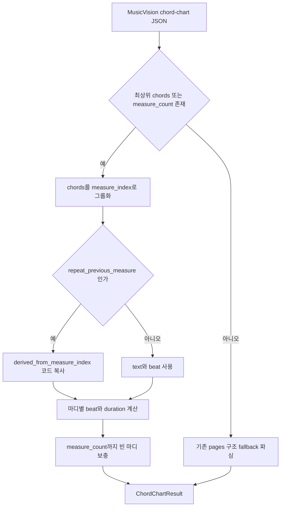
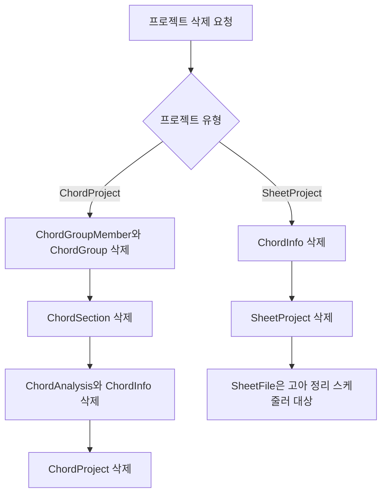

# OMR Chord Chart 응답 계약 및 프로젝트 삭제 FK 수정

## 작업 개요

`docs/spring_boot_backend.md`의 MusicVision 연동 계약 변경을 반영하고,
ChordProject 및 SheetProject 삭제 시 자식 레코드의 외래키 때문에 프로젝트 삭제가
실패하는 문제를 수정했다.

## 작업한 내용

### 1. Chord chart 응답 파싱 변경

- 기존 `pages[].systems[].measures[]` 기반 응답 대신 새 계약의 최상위
  `chords[]`를 우선 파싱한다.
- 다음 필드를 사용한다.
  - `measure_count`
  - `chords[].kind`
  - `chords[].text`
  - `chords[].measure_index`
  - `chords[].beat`
  - `chords[].source`
  - `chords[].derived_from_measure_index`
- `measure_count` 기준으로 코드가 없는 마디도 N.C. 마디로 유지한다.
- `source=repeat_previous_measure` 또는 `text=%`인 항목은
  `derived_from_measure_index`의 코드를 복사해 실제 코드 진행으로 변환한다.
- 기존 응답 구조는 MusicVision 배포 전환 중의 호환성을 위해 fallback으로 유지한다.

### 2. ChordProject 삭제 FK 수정

- ChordProject가 소유하는 `ChordInfo`, `ChordGroup`, `ChordSection`에 대해
  cascade delete 및 orphan removal을 적용했다.
- `ChordGroup` 삭제 시 기존 매핑을 통해 `ChordGroupMember`도 함께 삭제된다.
- `ChordInfo` 삭제 시 기존 매핑을 통해 `ChordAnalysis`도 함께 삭제된다.

삭제 순서는 논리적으로 다음과 같다.

1. `ChordGroupMember`
2. `ChordGroup`, `ChordSection`, `ChordAnalysis`
3. `ChordInfo`
4. `ChordProject`

### 3. SheetProject 삭제 FK 점검 및 수정

- SheetProject의 `ChordInfo` 연관관계에도 cascade delete 및 orphan removal을 적용했다.
- SheetProject 삭제 후 `SheetFile`은 즉시 삭제하지 않는다.
- 기존 `OrphanFileCleanupService`가 고아 `SheetFile`과 연결된 저장 파일을 정리하는
  현재 설계를 유지한다.

### 4. 테스트

- 새 chord chart 최상위 `chords[]` 파싱을 검증했다.
- 반복 마디가 원본 마디 코드로 해석되는지 검증했다.
- `measure_count` 안의 빈 마디가 유지되는지 검증했다.
- 실제 H2 외래키 환경에서 ChordProject의 코드/분석 자식 전체가 삭제되는지 검증했다.
- 실제 H2 외래키 환경에서 SheetProject의 ChordInfo가 삭제되고 SheetFile은
  고아 정리 대상으로 남는지 검증했다.
- 전체 `gradlew test`를 실행해 통과했다.

## 설계 의도

OMR 서버의 slim chord chart 응답을 백엔드 도메인 모델로 변환하는 책임은 기존과 같이
`OmrClient`에 유지했다. 상위 서비스와 `ChordProjectOmrProcessor`는
`ChordChartResult`만 사용하므로 MusicVision 응답 구조 변경이 도메인 서비스까지
전파되지 않는다.

프로젝트 삭제는 애플리케이션 서비스에서 테이블별 삭제 순서를 수동으로 나열하는 대신,
프로젝트 aggregate가 실제로 소유하는 자식 관계를 JPA 매핑에 명시했다. 이 방식은 일반
삭제, 향후 repository 직접 삭제, 테스트 환경에서 동일한 생명주기 규칙을 적용한다.

## 임의로 결정한 부분

- 반복 마디의 `%`를 그대로 ChordInfo에 저장하지 않고 참조 마디의 실제 코드로
  확장했다. 현재 화성 분석기가 `%`를 코드 심볼로 처리하지 못하고, 이전 응답 계약의
  `resolved_chords` 동작을 유지하기 위한 결정이다.
- 새 계약 전환 중 기존 MusicVision 응답을 받을 가능성을 고려해 기존
  `pages[].systems[].measures[]` 파서를 제거하지 않고 fallback으로 남겼다.
- SheetProject 삭제 시 SheetFile을 즉시 삭제하지 않았다. 저장 파일 정리는 기존
  고아 파일 스케줄러가 담당하고 있어 해당 책임을 변경하지 않았다.

## 클래스 역할

| 클래스 | 변경 | 역할 |
| --- | --- | --- |
| `OmrClient` | 수정 | MusicVision의 새 chord chart 응답을 내부 `ChordChartResult`로 변환한다. |
| `ChordProject` | 수정 | 코드, 분석 그룹, 분석 섹션의 aggregate 생명주기를 관리한다. |
| `SheetProject` | 수정 | 연결된 ChordInfo의 aggregate 생명주기를 관리한다. |
| `OmrClientTest` | 수정 | 새 chord chart 계약, 반복 마디, 빈 마디 파싱을 검증한다. |
| `ProjectDeletionCascadeTest` | 신규 | 실제 FK 환경에서 두 프로젝트 삭제 cascade를 검증한다. |

## 논리 흐름도

### Chord chart 결과 처리

### 프로젝트 삭제

## 개발자가 알아둘 내용

- 새 chord chart 계약에서 `measure_count`가 누락되면 가장 큰
  `measure_index`를 전체 마디 수로 사용한다.
- 반복 참조 대상 마디가 아직 없거나 잘못된 경우 해당 반복 항목은 건너뛰고 경고 로그를
  남긴다.
- 외부 REST API 요청/응답 명세는 변경하지 않았으므로 Swagger 수정은 필요하지 않다.
- `docs/spring_boot_backend.md`는 사용자가 제공한 계약 문서 변경 상태를 그대로 유지했다.
