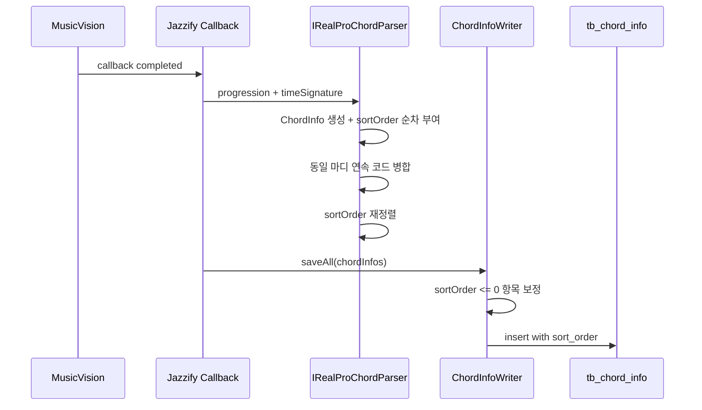

# OMR ChordInfo sort_order 저장 오류 수정

## 작업 내용

ChordProject OMR callback 처리 중 `tb_chord_info.sort_order`에 값이 들어가지 않아 발생하던 오류를 수정했다.

오류:

```text
Field 'sort_order' doesn't have a default value
insert into tb_chord_info (...)
```

수정 사항:

- `ChordInfo` 엔티티에 `sortOrder` 필드를 명시적으로 매핑했다.
- `IRealProChordParser`가 ChordProject/SheetProject용 `ChordInfo`를 만들 때 `sortOrder`를 1부터 순차 부여하도록 했다.
- 동일 마디의 연속 동일 코드가 병합된 뒤에도 `sortOrder`가 다시 1, 2, 3... 순서로 정리되도록 했다.
- `ChordInfoWriter.saveAll`에서 저장 직전 `sortOrder <= 0`인 항목은 리스트 순서 기준으로 보정하도록 방어 로직을 추가했다.

## OMR 도메인 점검 결과

| 도메인 | callback 완료 시 저장되는 주요 엔티티 | 점검 결과 |
| --- | --- | --- |
| `ChordProject` | `ChordProject`, `ChordInfo` | `ChordInfo.sortOrder` 누락이 실제 오류 원인. 수정 완료 |
| `SheetProject` | `SheetProject`, `ChordInfo` | 동일한 `IRealProChordParser` 경로를 사용하므로 함께 수정됨 |
| `Lick` | `Lick` | pending/complete writer가 `source`, `title`, `instrument`, `omrStatus`, `omrProgress` 등 non-null 필드에 fallback을 넣고 있음 |
| `Solo` | `Solo` | Lick과 같은 구조로 non-null 필드 fallback 확인 |

## 클래스 역할

| 클래스 | 역할 |
| --- | --- |
| `ChordInfo` | DB의 `sort_order` 컬럼을 `sortOrder` 필드로 매핑하고 값 보정 메서드 제공 |
| `IRealProChordParser` | OMR 결과 progression을 `ChordInfo` 목록으로 변환하며 `sortOrder`를 순차 생성 |
| `ChordInfoWriter` | `ChordInfo` 저장 직전 `sortOrder` 누락 값을 방어적으로 보정 |
| `IRealProChordParserTest` | ChordProject/SheetProject 파싱 결과가 `sortOrder=1,2,3...`을 갖는지 검증 |

## 논리 흐름도



## 설계 의도

`sort_order`는 DB에 이미 존재하는 non-null 컬럼이지만 엔티티에 매핑되어 있지 않아 Hibernate insert SQL에 포함되지 않았다. DB 기본값에 의존하는 방식 대신 애플리케이션에서 명시적으로 매핑하고 값을 채우도록 수정했다.

`sortOrder`는 분석과 표시에서 코드 진행의 안정적인 순서를 나타내는 값이므로, 파싱 결과 리스트 순서를 기준으로 1부터 부여했다. 코드 병합 후 순서 gap이 남지 않도록 최종 리스트에서 다시 번호를 매긴다.

## 임의로 결정한 부분

- `sortOrder` 시작값은 0이 아니라 1로 결정했다. 사람이 읽는 코드 진행 순서와 기존 `bar`/`beat` 표현에 맞추기 위해서다.
- `ChordInfoWriter`는 잘못된 값을 발견해도 예외를 던지지 않고 저장 직전에 보정한다. callback 작업이 DB 제약 오류로 실패하는 것을 막는 것이 우선이라고 판단했다.
- Lick/Solo는 `ChordInfo`를 저장하지 않으므로 별도 코드 변경 없이 writer의 non-null fallback만 확인했다.

## 개발자가 알아둬야 할 내용

- 운영 DB에 이미 `sort_order NOT NULL` 컬럼이 있으므로 이번 변경 후 Hibernate insert에 `sort_order`가 포함된다.
- 기존 데이터 중 `sort_order`가 0 또는 비정상 값인 row가 있다면 별도 데이터 정리 여부를 검토해야 한다. 이번 수정은 신규 저장 경로를 보정한다.
- ChordProject 수동 코드 등록(`POST /{publicId}/chords`)도 같은 파서를 사용하므로 `sortOrder`가 함께 채워진다.

## 검증

다음 테스트를 실행했다.

```text
./gradlew.bat test --tests "com.jazzify.backend.domain.chordproject.util.IRealProChordParserTest"
```

결과: 성공.
