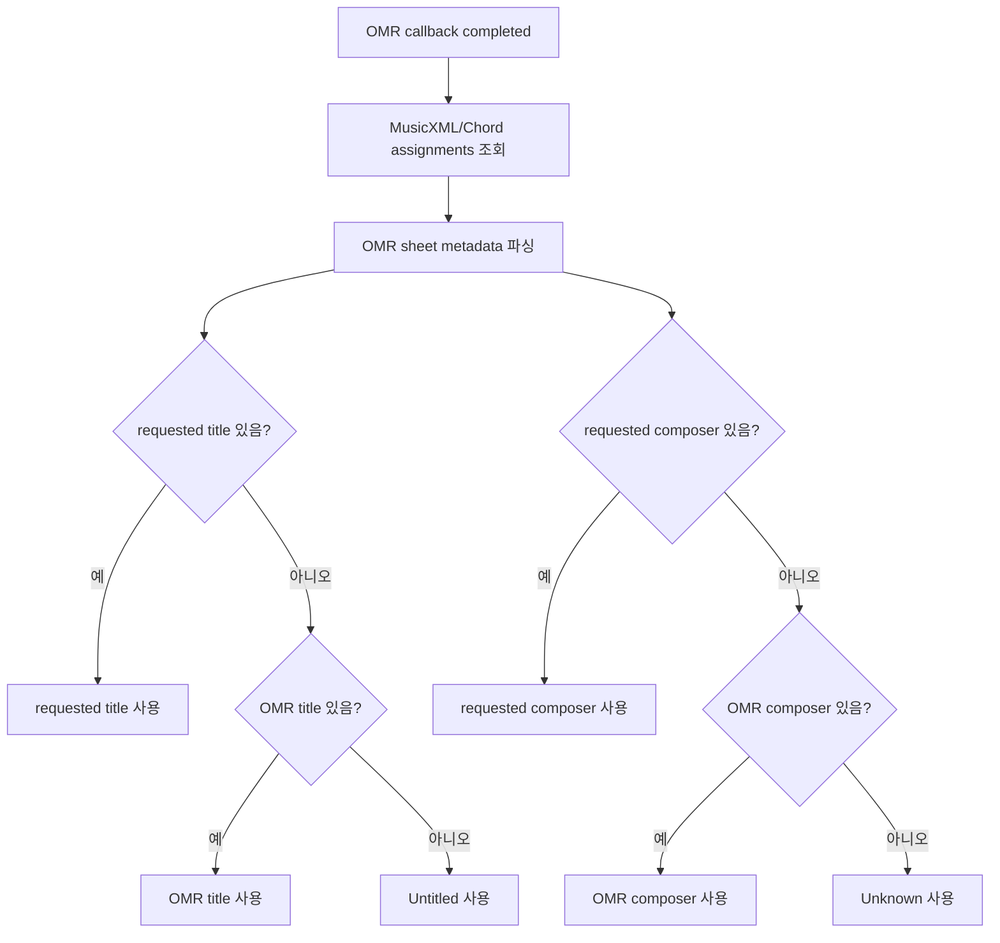
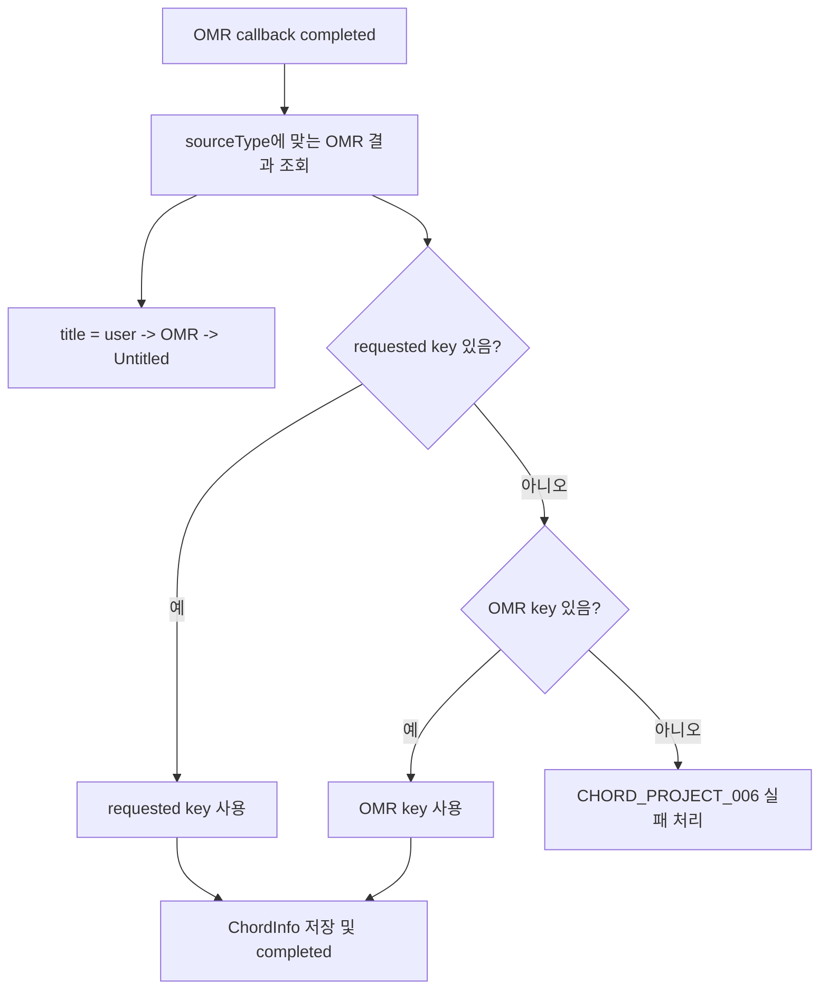

# OMR 메타데이터 우선순위 수정

## 작업 개요

Solo, Lick, ChordProject, SheetProject의 OMR 완료 처리에서 메타데이터 적용
우선순위를 점검하고 불일치한 부분을 수정했다.

적용 기준은 다음과 같다.

1. 사용자가 입력한 정보
2. OMR 서버에서 응답한 정보
3. 기본값

기본값은 제목 `Untitled`, composer/performer 계열 `Unknown`, 그 외 nullable 필드는
`null`을 유지하는 방향이다.

## 작업한 내용

### Solo, Lick

- OMR 요청 시 사용자가 입력한 `title`, `composer`를 엔티티의 별도 필드에 저장한다.
- 기존에는 pending 엔티티의 표시값인 `OMR Processing`이나 `Unknown`을 사용자 입력과
  구분하기 어려웠다.
- 완료 callback에서 다음 순서로 값을 확정한다.
  - `title`: requested title → MusicXML title → `Untitled`
  - `composer`: requested composer → MusicXML composer → `Unknown`
  - `key`, `timeSignature`, `tempo`: 사용자 입력 → MusicXML → `null`
- performer는 현재 OMR 서버 응답에 대응 필드가 없으므로 사용자 입력이 없으면 기존처럼
  `Unknown`으로 남는다.

### ChordProject

- 사용자 제목 미입력 시 파일명 base name을 임시 제목으로 쓰던 동작을 제거했다.
- 완료 callback에서 `title`은 requested title → OMR title → `Untitled` 순으로 확정한다.
- `key`는 requested key → OMR key 순으로만 확정한다.
- 내부 pending 엔티티 생성을 위해 임시 `C_MAJOR`를 쓰더라도, OMR이 key를 주지 않고
  사용자가 key를 입력하지 않은 경우 더 이상 `C_MAJOR`로 성공 처리하지 않는다.
  이 경우 기존 정책대로 `CHORD_PROJECT_006` 실패 상태로 전환한다.

### SheetProject

- 사용자 제목 입력 여부를 `title == "OMR Processing"` 문자열 비교로 추론하지 않고,
  requested title을 별도 필드에 저장한다.
- 완료 callback에서 `title`은 requested title → OMR title → `Untitled` 순으로 확정한다.
- `key`는 기존처럼 사용자 입력값이 있으면 우선하고, 없으면 OMR key를 사용한다.

### Swagger 및 문서

- 네 도메인의 OMR API 설명을 새 우선순위에 맞게 수정했다.
- 기존 agent 가이드의 ChordProject 파일명 기반 임시 제목 설명도 정정했다.

## 설계 의도

이번 문제의 핵심은 pending 상태에서 화면에 보여주기 위한 임시값과 사용자가 실제로
입력한 메타데이터가 같은 엔티티 필드에 섞인 점이었다. 따라서 callback 시점에 정확한
우선순위를 적용할 수 있도록 requested metadata를 별도 필드로 저장했다.

ChordProject는 DB 제약상 `keySignature`가 null일 수 없어 pending 생성에는 임시 key가
필요하다. 다만 이 임시 key는 내부 상태 유지를 위한 값일 뿐, OMR 완료 결과의 fallback
메타데이터로 사용하지 않도록 분리했다.

## 임의로 결정한 부분

- Solo/Lick의 performer, instrument, source 등 OMR 서버가 제공하지 않는 값은 기존
  도메인 기본 정책을 유지했다.
- ChordProject의 `timeSignature`는 엔티티가 non-null이고 기존 처리도 기본 `4/4`를
  요구하므로 사용자 입력 또는 OMR 값이 없으면 `4/4`를 유지했다.
- ChordProject의 pending 응답 제목은 사용자 제목이 없으면 `OMR Processing`으로 둔다.
  최종 완료 제목은 이 값이 아니라 requested title과 OMR title을 기준으로 다시 계산한다.

## 클래스 역할

| 클래스 | 변경 | 역할 |
| --- | --- | --- |
| `Solo` | 수정 | OMR 요청 시 사용자가 입력한 title/composer를 보관한다. |
| `Lick` | 수정 | OMR 요청 시 사용자가 입력한 title/composer를 보관한다. |
| `SheetProject` | 수정 | OMR 요청 시 사용자가 입력한 title을 보관한다. |
| `SoloWriter` | 수정 | pending Solo 생성 시 requested metadata를 기록한다. |
| `LickWriter` | 수정 | pending Lick 생성 시 requested metadata를 기록한다. |
| `SheetProjectOmrWriter` | 수정 | pending SheetProject 생성 시 requested title을 기록한다. |
| `SoloService` | 수정 | OMR 완료 시 Solo 메타데이터 우선순위를 적용한다. |
| `LickService` | 수정 | OMR 완료 시 Lick 메타데이터 우선순위를 적용한다. |
| `ChordProjectService` | 수정 | OMR 완료 시 ChordProject 제목/key 우선순위를 적용하고 임시 key 승격을 차단한다. |
| `SheetProjectService` | 수정 | OMR 완료 시 SheetProject 제목/key 우선순위를 적용한다. |
| `ChordProjectServiceOmrMetadataTest` | 신규 | ChordProject OMR callback 메타데이터 우선순위와 key 실패 조건을 검증한다. |

## 논리 흐름도

### Solo/Lick 완료 처리

### ChordProject 완료 처리

## 개발자가 알아둘 내용

- `omrRequestedTitle`, `omrRequestedComposer`는 callback 완료 시 우선순위 판정용이다.
  일반 생성/수정 API의 사용자 메타데이터 저장 필드가 아니다.
- pending 상태의 `title`, `keySignature`, `timeSignature`는 화면 표시와 DB 제약을 위한
  임시값일 수 있다.
- Swagger 문구만 수정했고 외부 요청/응답 필드 자체는 변경하지 않았다.
- 전체 테스트를 실행해 통과를 확인했다.
