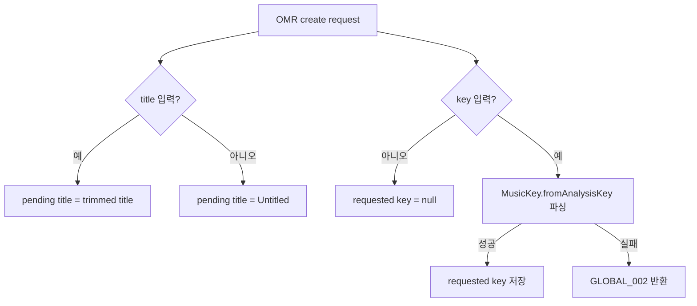
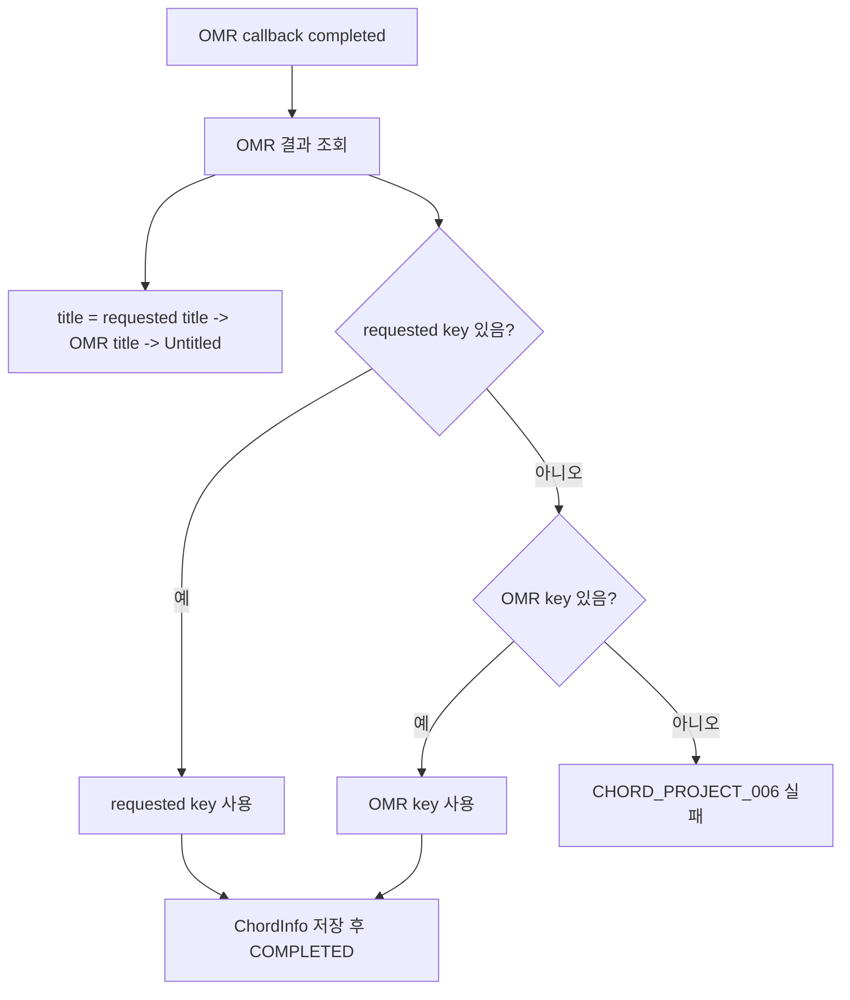

# OMR Processing 제목 및 Key 전달 수정

## 작업 개요

OMR 생성 요청 직후의 pending 메타데이터와 사용자 입력 key 전달 방식을 수정했다.

적용 기준은 다음과 같다.

1. OMR 처리 중 제목은 사용자가 입력한 `title`을 사용한다.
2. 사용자가 `title`을 입력하지 않으면 `OMR Processing`이 아니라 `Untitled`를 저장/응답한다.
3. ChordProject/SheetProject OMR의 `key`는 enum 바인딩 실패를 피하기 위해 문자열로 받고 서비스에서 명시적으로 `MusicKey`로 파싱한다.

## 작업한 내용

### 제목 처리

- ChordProject, SheetProject, Solo, Lick OMR 생성 경로의 pending 기본 제목을 `Untitled`로 변경했다.
- 사용자가 제목을 입력하면 기존처럼 입력 제목을 pending 엔티티에 저장한다.
- 완료 callback의 최종 제목 우선순위는 기존 정책을 유지한다.
  `requested title -> OMR title -> Untitled`

### Key 전달 처리

- `ChordProjectOmrCreateRequest.key`, `SheetProjectOmrCreateRequest.key` 타입을 `MusicKey`에서 `String`으로 변경했다.
- Spring multipart model binding 단계에서 `"Bb"`, `"F#m"`, `"B flat major"` 같은 실제 조성 표기가 enum 변환 실패로 막히지 않도록 했다.
- 서비스에서 `MusicKey.fromAnalysisKey`로 key를 파싱한다.
- 지원 형식은 예를 들어 다음과 같다.
  `B_FLAT_MAJOR`, `Bb`, `B flat major`, `F#m`, `C-min`, `C Major`
- 비어 있지 않은 key가 파싱되지 않으면 `GLOBAL_002` 잘못된 입력으로 즉시 실패시킨다.
- ChordProject는 DB 제약상 pending 엔티티의 `keySignature`가 null일 수 없어, 사용자가 key를 입력하지 않은 경우 내부 pending 값으로 `C_MAJOR`를 계속 사용한다. 단, 완료 callback에서는 이 임시값을 사용자 key fallback으로 승격하지 않는다.

### Swagger 및 문서

- ChordProject/SheetProject OMR Swagger에서 `key`가 enum 이름과 일반 조성 표기를 모두 받을 수 있음을 명시했다.
- ChordProject/SheetProject/Solo/Lick OMR Swagger에서 생성 직후 제목이 사용자 입력값 또는 `Untitled`임을 명시했다.
- `docs/agent/omr-async-frontend-guide.md`와 `docs/agent/omr-metadata-priority-fix.md`의 `OMR Processing` pending 제목 설명을 새 정책에 맞게 수정했다.

### 테스트

- `MusicKeyTest`를 추가해 enum 이름과 일반 조성 표기 파싱을 검증했다.
- `ChordProjectServiceOmrMetadataTest`에 OMR 생성 시 `Bb`가 `B_FLAT_MAJOR`로 저장되는 경로와 잘못된 key 거절 경로를 추가했다.
- Solo/Lick 관련 테스트 fixture의 pending 제목을 `Untitled`로 정정했다.

## 설계 의도

기존 문제는 OMR API의 key가 `MusicKey` enum으로 직접 바인딩되어 서비스 로직에 도달하기 전에 실패할 수 있다는 점이었다. multipart form-data에서는 프론트엔드가 `"Bb"`나 `"F#m"`처럼 사용자가 보는 조성 표기를 그대로 전달할 가능성이 높다. 따라서 요청 DTO는 문자열을 받아 transport 계층의 변환 실패를 제거하고, 도메인 서비스가 지원 형식과 실패 방식을 직접 통제하게 했다.

제목은 화면 표시용 pending 값과 최종 메타데이터 판정값을 혼동하지 않도록 `OMR Processing` sentinel을 제거했다. 사용자가 제목을 입력하지 않았다는 사실은 `omrRequestedTitle == null`로 이미 보관되므로, pending 제목을 sentinel 문자열로 둘 필요가 없다.

## 임의로 결정한 부분

- ChordProject/SheetProject 일반 생성/수정 API의 `key` 타입은 기존 `MusicKey` enum으로 유지했다. 이번 문제는 OMR multipart 입력 경로에 한정했다.
- 잘못된 key 문자열은 null로 무시하지 않고 `GLOBAL_002`로 실패시켰다. 사용자가 key를 입력했는데 무시하면 완료 callback에서 OMR key fallback으로 넘어가 문제 원인 파악이 어려워진다.
- ChordProject pending 내부 key `C_MAJOR`는 DB non-null 제약 때문에 유지했다. 이 값은 완료 결과의 fallback으로 사용하지 않는다.

## 클래스 역할

| 클래스 | 변경 | 역할 |
| --- | --- | --- |
| `MusicKey` | 수정 | enum 이름과 일반 조성 표기를 `MusicKey`로 정규화한다. |
| `ChordProjectOmrCreateRequest` | 수정 | OMR multipart key를 문자열로 받는다. |
| `SheetProjectOmrCreateRequest` | 수정 | OMR multipart key를 문자열로 받는다. |
| `ChordProjectService` | 수정 | pending 제목 기본값을 `Untitled`로 변경하고 사용자 key 문자열을 파싱한다. |
| `SheetProjectService` | 수정 | pending 제목 기본값을 `Untitled`로 변경하고 사용자 key 문자열을 파싱한다. |
| `SoloService` | 수정 | pending 제목 기본값을 `Untitled`로 변경한다. |
| `LickService` | 수정 | pending 제목 기본값을 `Untitled`로 변경한다. |
| `ChordProjectControllerSpec` | 수정 | OMR 제목/key 정책 Swagger 설명을 갱신한다. |
| `SheetProjectControllerSpec` | 수정 | OMR 제목/key 정책 Swagger 설명을 갱신한다. |
| `SoloControllerSpec` | 수정 | OMR pending 제목 정책 Swagger 설명을 갱신한다. |
| `LickControllerSpec` | 수정 | OMR pending 제목 정책 Swagger 설명을 갱신한다. |
| `MusicKeyTest` | 신규 | key 표기 파싱 지원 형식을 검증한다. |
| `ChordProjectServiceOmrMetadataTest` | 수정 | OMR 생성 시 사용자 key 파싱과 invalid key 실패를 검증한다. |

## 논리 흐름도

### OMR 생성 메타데이터 처리

### ChordProject 완료 처리

## 개발자가 알아둘 내용

- OMR multipart key는 이제 문자열이다. 프론트엔드는 enum 이름 또는 일반 조성 표기를 전달할 수 있다.
- invalid key는 OMR 서버 제출 전에 실패한다.
- pending 응답에서 제목 미입력은 `Untitled`로 보인다.
- 검증 실행은 현재 다른 에이전트의 Chat/RAG 변경으로 전체 컴파일이 막혀 완료하지 못했다.
  - `./gradlew.bat test ...`는 `ChatServiceTest`, `ClaudeChatStreamerTest`, `RagChatStreamerTest`의 기존 시그니처 불일치로 `compileTestJava`에서 실패했다.
  - `./gradlew.bat compileJava`는 `ChatController`의 `@Override` 불일치로 실패했다.
  - OMR 변경 파일에 대한 `git diff --check`는 whitespace error 없이 통과했다.
