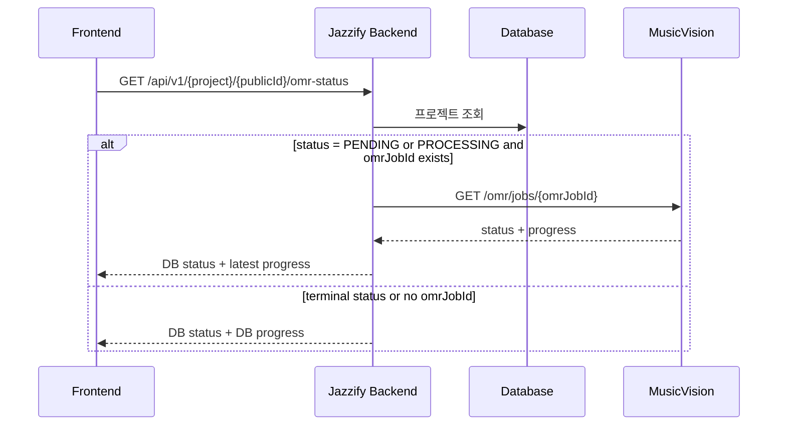

# OMR status progress 조회 변경

## 작업 내용

ChordProject와 SheetProject의 `omr-status` API가 MusicVision status endpoint를 조회해 최신 `progress`를 응답하도록 수정했다.

```text
GET /omr/jobs/{job_id}
X-OMR-API-Key: <omr-api-key>
```

적용 대상:

- `GET /api/v1/chord-projects/{publicId}/omr-status`
- `GET /api/v1/sheet-projects/{publicId}/omr-status`

기존 응답 DTO는 이미 `progress` 필드를 가지고 있으므로 API 응답 구조는 바꾸지 않았다. 변경된 것은 `PENDING` 또는 `PROCESSING` 상태에서 progress 값을 가져오는 방식이다.

## 설계 의도

기존 구현은 OMR 제출 직후 `10`, 콜백 처리 중 `80`, 완료 시 `100`처럼 백엔드 DB에 저장된 고정 progress만 반환했다. MusicVision이 job status endpoint에서 세부 진행률을 제공하므로, 프론트엔드 polling API인 `omr-status`가 이 값을 실시간에 가깝게 반환하도록 변경했다.

MusicVision 조회는 `PENDING` 또는 `PROCESSING` 상태이고 `omrJobId`가 있을 때만 수행한다. 이미 `COMPLETED` 또는 `FAILED`인 경우에는 DB 상태를 그대로 반환한다.

MusicVision status 조회에 실패하면 기존 DB progress를 fallback으로 반환한다. 사용자의 상태 polling API가 외부 status endpoint의 일시적 실패 때문에 바로 실패하는 것을 피하기 위한 결정이다.

## 클래스 및 레코드 역할

| 클래스/레코드 | 역할 |
| --- | --- |
| `OmrClient` | `GET /omr/jobs/{jobId}` 호출 메서드 `fetchJobStatus` 추가 |
| `OmrClient.OmrJobStatusResult` | MusicVision status 응답 중 `jobId`, `status`, `message`, `progress`를 외부로 전달 |
| `ChordProjectService` | ChordProject status 조회 시 진행 중이면 MusicVision progress를 응답에 반영 |
| `SheetProjectService` | SheetProject status 조회 시 진행 중이면 MusicVision progress를 응답에 반영 |
| `OmrClientTest` | status endpoint 조회, progress 파싱, `X-OMR-API-Key` 헤더 전달 검증 |

## 논리 흐름도



## 임의로 결정한 부분

- MusicVision status endpoint가 실패해도 `omr-status` API는 실패시키지 않고 DB progress를 반환하도록 했다.
- MusicVision에서 받은 `progress`는 `0~100` 범위로 보정해서 응답한다.
- MusicVision의 `status` 자체는 이번 변경에서 백엔드 프로젝트 상태로 덮어쓰지 않았다. 완료/실패 반영은 기존 callback 흐름이 담당한다.

## 개발자가 알아둬야 할 내용

- `omr-status` 응답의 `progress`는 진행 중 상태에서 MusicVision 값이 우선이고, 조회 실패 또는 terminal 상태에서는 DB 값이 사용된다.
- status endpoint 호출도 기존 `omr.api-key`를 사용해 `X-OMR-API-Key` 헤더를 붙인다.
- 응답 DTO 스키마는 그대로라 프론트엔드 타입 변경은 필요 없다.

## 검증

다음 테스트를 실행했다.

```text
./gradlew.bat test --tests "com.jazzify.backend.shared.omr.OmrClientTest"
```

결과: 성공.
