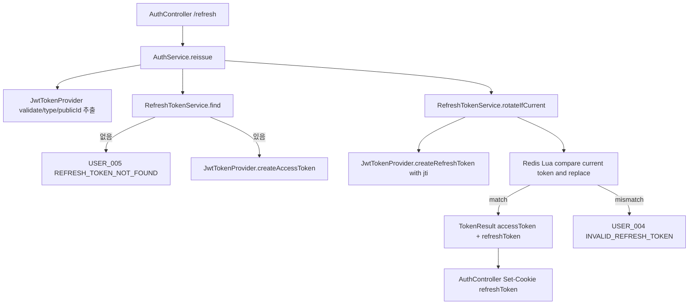

# 20260608-211834 Refresh Token RTR Hardening

## 작업한 내용

- RTR refresh token 갱신 흐름을 점검했다.
- `JwtTokenProvider`가 JWT `jti`를 발급하도록 수정했다.
  - 같은 사용자, 같은 권한, 같은 초에 토큰을 발급해도 access token과 refresh token 문자열이 매번 달라진다.
- `RefreshTokenService`에 Redis Lua 기반 `rotateIfCurrent`를 추가했다.
  - 저장된 refresh token이 요청 refresh token과 정확히 일치할 때만 새 refresh token으로 원자적 교체를 수행한다.
- `AuthService.reissue`에서 기존 `조회 -> 비교 -> delete -> rotate` 흐름을 `존재 확인 -> 원자적 rotate` 흐름으로 변경했다.
  - 동시 refresh 요청 중 하나가 stale token으로 실패하더라도 현재 Redis에 저장된 정상 refresh token을 즉시 삭제하지 않는다.
- 관련 단위 테스트를 추가했다.
  - `JwtTokenProviderTest`
  - `RefreshTokenServiceTest`

## 설계 의도

기존 구조는 RTR 자체는 구현되어 있었지만 두 가지 false-positive 가능성이 있었다.

1. JWT payload에 `jti`가 없어 같은 초에 같은 claim으로 발급된 토큰이 동일 문자열이 될 수 있었다.
2. refresh token 검증과 교체가 Redis에서 원자적으로 처리되지 않았다. 병렬 refresh 요청이 들어오면 한 요청이 새 토큰으로 교체한 직후, 다른 요청이 이전 토큰을 재사용으로 판단하고 새 정상 토큰까지 삭제할 수 있었다.

이번 변경은 refresh token family를 무조건 느슨하게 허용하지 않고, 저장 토큰과 요청 토큰이 일치하는 경우에만 교체한다. 다만 mismatch 시 즉시 Redis 토큰을 삭제하지 않아서 브라우저/탭/네트워크 병렬 요청으로 인한 정상 세션 파괴 가능성을 줄였다.

## 임의로 결정한 부분

- 쿠키 설정 자체는 변경하지 않았다.
  - 현재 dev/prod 모두 `server.servlet.context-path: /api`이고 쿠키 `Path=/api`라서 `https://jazzify.p-e.kr/api/v1/auth/refresh` 호출에는 쿠키 전송/교체 범위가 맞다.
- API 응답 형식과 endpoint는 변경하지 않았다.
  - Swagger 명세 업데이트는 필요하지 않다.
- refresh token mismatch 시 기존처럼 `USER_004`를 반환하되, Redis의 현재 refresh token은 삭제하지 않는 정책으로 정했다.
  - 보안상 강한 재사용 감지 정책은 token family 전체 폐기지만, 현재 증상은 병렬 refresh 또는 쿠키 교체 타이밍으로 인한 false-positive 가능성이 더 크다고 판단했다.

## 새로 추가한 클래스

| 클래스 | 역할 |
| --- | --- |
| `JwtTokenProviderTest` | JWT 발급 시 `jti`가 포함되고 같은 사용자/권한으로 연속 발급해도 refresh token 문자열이 달라지는지 검증 |
| `RefreshTokenServiceTest` | Redis Lua 기반 refresh token 원자 교체가 성공/실패 케이스에서 의도대로 동작하고, mismatch 시 기존 토큰을 삭제하지 않는지 검증 |

## 클래스간 논리 흐름도

## 개발자가 알아둬야 하는 내용

- 프론트엔드는 계속 `/v1/auth/refresh` 호출에 `credentials: include`를 사용해야 한다.
- 여러 탭에서 동시에 refresh가 발생하면 한 요청은 `USER_004`를 받을 수 있지만, 이번 변경 이후 그 실패가 곧바로 Redis의 최신 refresh token 삭제로 이어지지는 않는다.
- 쿠키 교체 실패가 계속 의심되면 운영 응답의 `Set-Cookie`가 `Path=/api`, `Secure`, `SameSite=None`으로 내려오는지 브라우저 Network 탭에서 확인해야 한다.
- 전체 테스트는 `./gradlew.bat test`로 통과했다.
