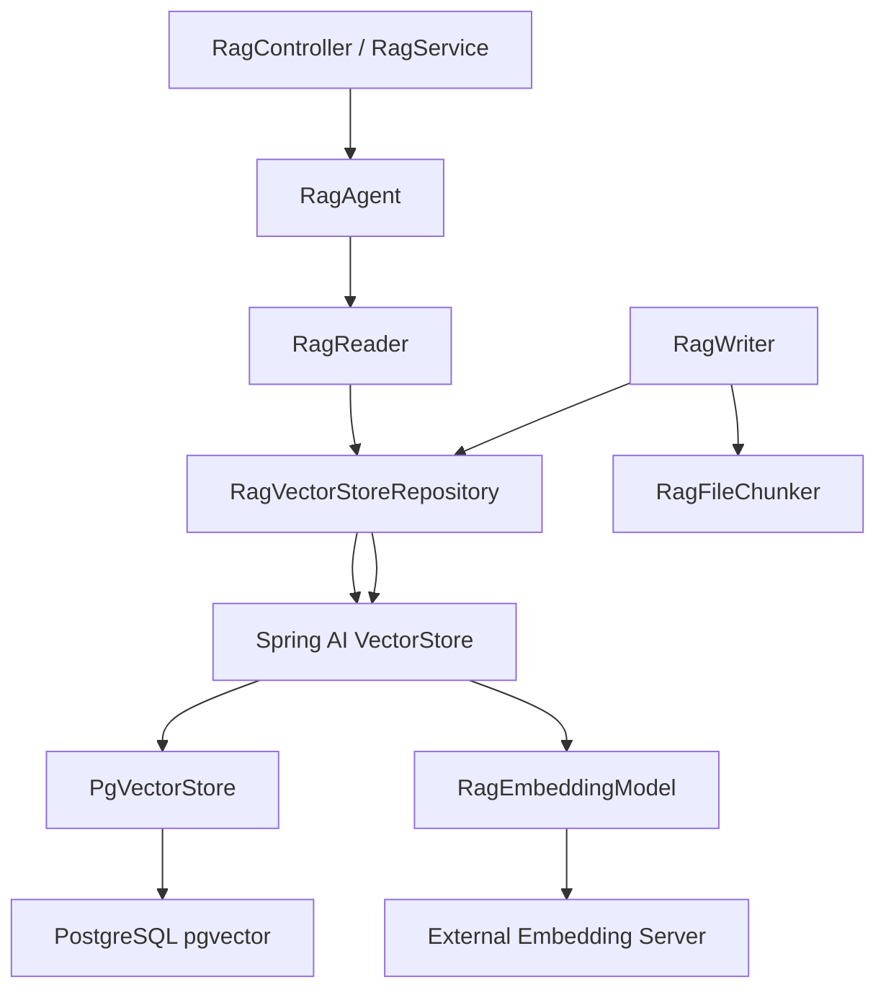

# Spring AI 기반 RAG 전환 작업 문서

## 1. 작업한 내용

기존 Jazzify 백엔드의 RAG는 다음 구조였다.

- LLM 호출: Spring AI Anthropic `StreamingChatModel`
- RAG 임베딩: 커스텀 HTTP 클라이언트 (`RagEmbeddingClient`)
- 벡터 저장/검색: `JdbcTemplate` + 수기 pgvector SQL (`RagChunkRepository`)
- 멀티 쿼리 RRF: `RagAgent`

이번 작업에서는 **RAG의 벡터 저장/검색 계층을 Spring AI 기반으로 전환**했다.

구체적으로 바뀐 점:

1. `spring-ai-pgvector-store` 의존성 추가
2. 외부 임베딩 서버를 Spring AI `EmbeddingModel`로 감싼 `RagEmbeddingModel` 추가
3. `PgVectorStore`를 수동 등록하는 `RagVectorStoreConfig` 추가
4. `RagVectorStoreRepository`를 추가하여
   - 문서 chunk 적재
   - 유사도 검색
   - 문서 단위 삭제
   - chunk count 조회
   를 Spring AI `VectorStore` 기반으로 수행하도록 변경
5. `RagReader`, `RagWriter`, `RagAgent`, `RagService`를 새 구조에 맞게 수정
6. 기존 `rag_chunk` 커스텀 벡터 테이블 의존을 제거하고, Spring AI vector table(`rag_chunk_store`) 기준으로 count를 계산하도록 변경
7. 테스트 추가/보정 후 전체 테스트 통과 확인

---

## 2. 설계 의도

핵심 의도는 다음 3가지다.

### 2.1 Spring AI 추상화 위로 올리기

기존에는 pgvector SQL과 embedding 호출을 애플리케이션이 직접 다루고 있었다.
이 방식은 유연하지만, 유지보수 비용이 크고 프레임워크 레벨의 확장 포인트를 살리기 어렵다.

그래서 다음 구조로 바꿨다.

- 임베딩: `EmbeddingModel`
- 벡터 저장/검색: `VectorStore` / `PgVectorStore`
- 검색 요청: `SearchRequest`

즉, **RAG 로직을 Spring AI 표준 인터페이스 위에 올리고**, Jazzify 도메인 특화 로직(RRF, query decomposition)은 그대로 유지했다.

### 2.2 도메인 특화 로직은 유지

이번 전환은 “Spring AI가 다 하게” 만드는 것이 아니라,
**Spring AI는 인프라 계층**, **Jazzify는 리트리벌 전략 계층**을 맡는 구조로 정리하는 데 목적이 있다.

유지한 것:

- chord context 기반 query decomposition
- multi-query retrieval
- RRF fusion
- RAG debug block 스트리밍
- 문서 chunking 규칙

즉, **재즈 도메인 로직은 유지하고 저장/검색 인터페이스만 Spring AI로 바꾼 전환**이다.

### 2.3 자동설정보다 수동 구성을 선택

처음에는 `spring-ai-starter-vector-store-pgvector`를 추가했지만,
이 경우 RAG가 비활성화된 테스트 컨텍스트에서도 Spring AI auto-configuration이 vector store bean을 만들려 하면서 실패했다.

그래서 최종적으로는:

- `spring-ai-pgvector-store`만 사용
- `RagVectorStoreConfig`에서 조건부(`rag.enabled=true`)로 수동 등록

방식을 택했다.

이렇게 하면 현재 프로젝트의 `rag.enabled` 토글과 정확히 맞물린다.

---

## 3. 생성/수정된 주요 클래스

### 3.1 클래스 역할 표

| 클래스 | 종류 | 역할 |
|---|---|---|
| `RagVectorStoreConfig` | config | `PgVectorStore`를 `rag.enabled=true`일 때만 등록하는 Spring AI 벡터스토어 구성 |
| `RagEmbeddingModel` | implementation | 기존 외부 임베딩 서버를 Spring AI `EmbeddingModel` 인터페이스로 감싼 어댑터 |
| `RagVectorStoreRepository` | repository | Spring AI `VectorStore`를 이용한 chunk 적재/검색/삭제/count 담당 |
| `RagReader` | implementation | 기존 `RagChunkRepository` 대신 `RagVectorStoreRepository`로 검색/카운트 수행 |
| `RagWriter` | implementation | chunk 임베딩/저장을 직접 하지 않고 `RagVectorStoreRepository`에 위임 |
| `RagAgent` | implementation | 사전 임베딩 계산 없이 query 단위로 `RagReader.search(...)` 호출 후 RRF 수행 |
| `RagService` | service | 헬스체크와 오케스트레이션에서 새 `RagEmbeddingModel` 기준으로 동작 |
| `RagDocumentRepository` | repository | 문서별 chunk count를 Spring AI vector table 메타데이터 기준으로 계산 |

### 3.2 클래스 간 논리 흐름도

설명:

- 검색 시:
  - `RagAgent`가 멀티 쿼리를 만든다.
  - 각 쿼리는 `RagReader` → `RagVectorStoreRepository` → `VectorStore.similaritySearch(...)` 경로로 검색된다.
  - 검색 결과는 다시 `RagAgent`에서 RRF로 융합된다.
- 저장 시:
  - `RagWriter`가 문서를 chunk로 분해한다.
  - chunk는 Spring AI `VectorStore.add(...)`를 통해 적재된다.
  - 임베딩은 `RagEmbeddingModel`이 외부 서버를 호출해 생성한다.

---

## 4. 수정된 파일 목록

### 코드
- `build.gradle`
- `src/main/java/com/jazzify/backend/domain/rag/config/RagProperties.java`
- `src/main/java/com/jazzify/backend/domain/rag/config/RagVectorStoreConfig.java` (신규)
- `src/main/java/com/jazzify/backend/domain/rag/service/implementation/RagEmbeddingModel.java` (신규)
- `src/main/java/com/jazzify/backend/domain/rag/repository/RagVectorStoreRepository.java` (신규)
- `src/main/java/com/jazzify/backend/domain/rag/repository/RagDocumentRepository.java`
- `src/main/java/com/jazzify/backend/domain/rag/service/implementation/RagReader.java`
- `src/main/java/com/jazzify/backend/domain/rag/service/implementation/RagWriter.java`
- `src/main/java/com/jazzify/backend/domain/rag/service/implementation/RagAgent.java`
- `src/main/java/com/jazzify/backend/domain/rag/service/RagService.java`
- `src/main/java/com/jazzify/backend/domain/rag/controller/RagControllerSpec.java`
- `src/main/resources/application-dev.yml`
- `src/main/resources/application-prod.yml`

### 테스트
- `src/test/java/com/jazzify/backend/domain/rag/repository/RagVectorStoreRepositoryTest.java` (신규)
- `src/test/java/com/jazzify/backend/domain/rag/service/RagServiceTest.java`

---

## 5. 내가 스스로 결정한 부분

명시 지시가 없어서 아래는 작업 중 내가 판단해서 결정한 사항이다.

### 5.1 스타터 대신 라이브러리 모듈 사용

원래는 `spring-ai-starter-vector-store-pgvector`를 추가했지만,
전체 테스트에서 `BackendApplicationTests`가 깨졌다.

원인:
- RAG가 비활성화되어도 starter auto-config가 `EmbeddingModel`을 찾으려 하며 컨텍스트 로딩 실패

결정:
- `spring-ai-pgvector-store`로 교체
- vector store는 `RagVectorStoreConfig`에서 조건부로 수동 등록

### 5.2 기존 외부 임베딩 서버는 유지

Spring AI 기반으로 바꾸면서도, 임베딩 생성 자체를 다른 모델로 바꾸지는 않았다.

이유:
- 현재 시스템은 이미 외부 임베딩 서버를 전제로 하고 있음
- 한 번에 “임베딩 공급자”까지 바꾸면 변경 범위가 너무 커짐

결정:
- 기존 임베딩 서버는 유지
- 대신 그것을 Spring AI `EmbeddingModel` 어댑터로 감쌈

### 5.3 VectorStore 필터링은 보수적으로 적용

기존 SQL은 `ILIKE`, 배열 포함 검색 등 세밀한 필터를 SQL에서 직접 처리했다.
Spring AI `SearchRequest.filterExpression(...)`로도 일부 표현은 가능하지만,
현 시점에서는 표현식 문법과 메타데이터 형태 차이 때문에 런타임 리스크가 있다.

결정:
- 우선 벡터 검색 결과를 oversampling 해서 가져온 뒤
- song/tag/sourceType/level은 Java에서 후처리 필터링

이 방식은 약간 비효율적일 수 있지만, 마이그레이션 안정성은 높다.

### 5.4 vector table 이름을 별도 분리

Spring AI pgvector가 기대하는 테이블 스키마는 기존 `rag_chunk`와 다르다.

결정:
- 새 vector table 기본값을 `rag_chunk_store`로 둠
- 기존 `rag_chunk` 커스텀 스키마와 충돌하지 않도록 분리

---

## 6. 개발자가 알아둬야 하는 내용

### 6.1 이제 RAG 검색/적재는 Spring AI VectorStore를 사용한다

현재 RAG 벡터 흐름은 더 이상 `RagChunkRepository` 중심이 아니다.
실제 경로는 아래와 같다.

- 적재: `RagWriter` → `RagVectorStoreRepository.saveAll(...)` → `VectorStore.add(...)`
- 검색: `RagReader.search(...)` → `RagVectorStoreRepository.search(...)` → `VectorStore.similaritySearch(...)`

### 6.2 `RagChunkRepository`는 현재 핵심 경로에서 사용되지 않는다

파일은 남아 있어도 핵심 RAG 경로에서는 벗어났다.
향후 정리 시점에 제거 후보로 봐도 된다.

### 6.3 chunk count는 vector table 메타데이터 기준으로 계산한다

문서 목록/단건 응답의 `chunkCount`는 이제 Spring AI vector table(`rag_chunk_store`)에서
`metadata.documentPublicId` 기준으로 집계된다.

즉, 운영 중에는 아래 두 테이블의 의미가 다르다.

- `rag_document`: 문서 본문/메타 원본
- `rag_chunk_store`: Spring AI가 관리하는 벡터 인덱스 저장소

### 6.4 스키마 초기화 설정이 분리되었다

YAML에 아래 설정이 추가되었다.

- `rag.vector-store.schema-name`
- `rag.vector-store.table-name`
- `rag.vector-store.initialize-schema`
- `rag.vector-store.schema-validation`
- `rag.vector-store.dimensions`

주의:
- `rag.bootstrap.create-schema`는 여전히 `rag_document` 생성과 관련 있음
- `rag.vector-store.initialize-schema`는 Spring AI vector table 생성 여부와 관련 있음

운영 시 두 설정을 혼동하지 않아야 한다.

### 6.5 임베딩 차원 기본값은 768로 두었다

이 값은 기존 Python RAG의 `paraphrase-multilingual-mpnet-base-v2` 기준을 따른다.
즉, 외부 임베딩 서버도 같은 차원을 반환한다는 가정이다.

임베딩 서버를 바꾸면 다음을 같이 봐야 한다.

- `rag.vector-store.dimensions`
- 기존 vector table 재생성 필요 여부
- 기존 벡터 데이터 재색인 필요 여부

---

## 7. 검증 내용

실행한 검증:

1. `compileJava`
2. 집중 테스트 실행
   - `RagAgentTest`
   - `RagChatStreamerTest`
   - `RagVectorStoreRepositoryTest`
   - `RagServiceTest`
   - `ClaudeChatStreamerTest`
   - `ChatServiceTest`
3. 전체 `test`

최종 결과:
- **전체 테스트 통과**

---

## 8. 후속 추천 작업

### 우선순위 높음
1. `RagChunkRepository` 제거 여부 결정
2. `RagVectorStoreRepository.search(...)`의 후처리 필터를 Spring AI filter expression으로 더 정교화할지 검토
3. 운영 문서에 `rag_document` / `rag_chunk_store` 역할 차이 추가

### 중간 우선순위
4. `RagEmbeddingClient`는 현재 사실상 대체되었으므로 정리 후보 검토
5. Spring AI `ChatClient` / Advisor 계층까지 도입해 RAG orchestration도 더 프레임워크화할지 검토

### 장기
6. 외부 임베딩 서버 대신 표준 Spring AI `EmbeddingModel` 공급자(OpenAI, Ollama 등)로 완전 전환 검토

---

## 9. 요약

이번 작업으로 Jazzify의 RAG는 다음 상태가 되었다.

- **LLM**: 기존처럼 Spring AI 사용
- **RAG 벡터 저장/검색**: 이제 Spring AI `PgVectorStore` 사용
- **도메인 전략(query decomposition / RRF / debug block)**: 기존 Jazzify 커스텀 로직 유지

즉,

> **“재즈 도메인 로직은 유지하고, 벡터 인프라 계층만 Spring AI 표준 추상화로 올린 전환”**

으로 정리할 수 있다.

