# Spring Java 기준 RAG / LLM(Chat) 논리 흐름 문서

## 1. 문서 목적

이 문서는 **Jazzify 백엔드의 Spring Java 코드만** 기준으로,
사용자가 이해할 수 있도록 **LLM(Chat)** 과 **RAG** 의 논리 흐름을 설명한다.

다음 범위만 다룬다.

- Direct Chat(일반 LLM 채팅)
- RAG Chat(검색 증강 생성 채팅)
- Spring AI 기반 LLM 스트리밍 호출
- Spring AI `VectorStore` 기반 RAG 검색
- 채팅 세션/메시지 영속화

다음 범위는 의도적으로 추상화하거나 생략한다.

- Python RAG 서버 구현
- 프론트엔드 렌더링 상세
- JWT/인증 내부 구현 상세
- 일반 도메인(analysis, chordproject, sheetproject 등)의 내부 알고리즘 상세
- 인프라 배포 상세(Docker, nginx, 운영 서버 설정)

---

## 2. 이번 문서에서 정리한 내용

1. Spring Java 코드 기준의 **Direct Chat 흐름**
2. Spring Java 코드 기준의 **RAG Chat 흐름**
3. 두 흐름이 공통으로 사용하는 **채팅 영속화 구조**
4. **Spring AI / Anthropic / VectorStore** 가 실제로 어느 계층에서 동작하는지
5. 각 클래스의 역할 표
6. 클래스 간 논리 흐름도
7. 개발자가 알아두면 좋은 구조적 포인트

---

## 3. 전체 요약

Jazzify의 Spring Java 구조는 크게 아래처럼 나뉜다.

- **Direct Chat**: 사용자의 질문과 대화 히스토리를 바탕으로 바로 LLM을 호출한다.
- **RAG Chat**: 질문 전에 RAG가 관련 문서 청크를 검색하고, 그 검색 결과를 system prompt에 붙여 LLM을 호출한다.
- **공통부**: 두 흐름 모두 `ChatService`를 통해 채팅 세션을 준비하고, 응답이 끝나면 `Chat` / `ChatMessage`로 저장한다.

핵심 차이는 다음 한 줄로 요약할 수 있다.

> **Direct Chat은 “히스토리 + 현재 질문” 중심이고, RAG Chat은 “히스토리 + 현재 질문 + 검색된 문맥” 중심이다.**

---

## 4. 설계 의도

### 4.1 LLM 호출과 도메인 로직을 분리

LLM 호출 자체는 `AnthropicStreamingClient`가 맡고,
도메인 계층은 그 위에서 **어떤 메시지를 만들지**만 결정한다.

즉,

- `ClaudeChatStreamer`, `RagChatStreamer`: 프롬프트/메시지 조립
- `AnthropicStreamingClient`: 실제 스트리밍 호출

구조로 나뉜다.

이렇게 하면 모델 공급자 변경 또는 호출 방식 변경이 생겨도,
상위 도메인 서비스는 비교적 안정적으로 유지할 수 있다.

### 4.2 Direct Chat과 RAG Chat의 저장 구조를 통합

사용자 입장에서 둘 다 “채팅”이므로,
영속화 모델은 분리하지 않고 `Chat` / `ChatMessage`를 공통으로 사용한다.

대신 `ChatType`으로 구분한다.

- `DIRECT`
- `RAG`

이렇게 해서 저장 구조는 단순하게 유지하고,
실제 응답 생성 방식만 분기했다.

### 4.3 RAG는 Spring AI를 인프라 계층으로 사용

RAG의 핵심 전략은 Jazzify 코드에 남겨두고,
벡터 저장/검색 인프라는 Spring AI에 위임했다.

즉 역할이 분리된다.

- Jazzify 커스텀 로직: `RagAgent`
  - 쿼리 분해
  - 다중 검색
  - RRF 융합
  - LLM용 문맥 포맷팅
- Spring AI 인프라: `VectorStore`, `PgVectorStore`, `EmbeddingModel`
  - 청크 저장
  - 벡터 유사도 검색
  - 임베딩 생성 연동

### 4.4 스트리밍 응답과 저장 시점을 분리

응답은 스트리밍으로 즉시 사용자에게 보내되,
저장은 응답 종료 후 `persistTurn(...)`에서 수행한다.

따라서 사용자는 빠르게 토큰을 받으면서,
서버는 최종적으로 user/assistant 턴을 일관되게 저장할 수 있다.

---

## 5. 상위 아키텍처

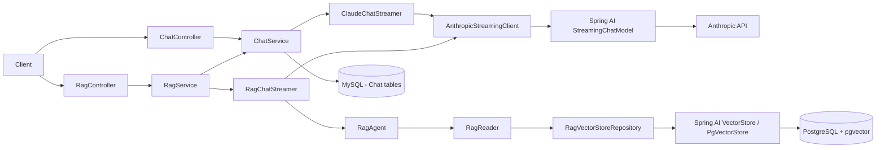

설명:

- **왼쪽 가지**는 Direct Chat 경로다.
- **오른쪽 가지**는 RAG 검색 후 LLM으로 이어지는 경로다.
- 두 경로 모두 최종 LLM 스트리밍은 `AnthropicStreamingClient`로 모인다.
- 채팅 저장은 `ChatService`를 통해 공통 처리된다.

---

## 6. Direct Chat 논리 흐름

대상 엔드포인트:

- `POST /v1/chat/stream`

관련 주요 클래스:

- `ChatController`
- `ChatService`
- `ClaudeChatStreamer`
- `AnthropicStreamingClient`
- `ChatReader`
- `ChatWriter`

### 6.1 흐름 설명

1. 클라이언트가 `ChatController.stream(...)`로 요청한다.
2. `ChatService.prepareDirectStream(...)`이 호출된다.
3. 서버는
   - 사용자 확인
   - 기존 채팅 재사용 여부 확인
   - 필요 시 새 `Chat` 생성
   - 기존 메시지 또는 최초 seed history 정리
   를 수행한다.
4. 준비가 끝나면 `PreparedChatStream`이 만들어진다.
5. 이후 `ChatService.streamPreparedDirect(...)`가 `ClaudeChatStreamer`를 호출한다.
6. `ClaudeChatStreamer`는
   - system prompt 구성
   - 과거 history 메시지 반영
   - 현재 user message 조립
   - 이미지가 있으면 멀티모달 `UserMessage` 구성
   을 수행한다.
7. 완성된 Spring AI `Message` 목록을 `AnthropicStreamingClient`에 넘긴다.
8. `AnthropicStreamingClient`가 `StreamingChatModel`로 스트리밍 호출한다.
9. 들어오는 토큰을 `OutputStream`에 즉시 기록한다.
10. 스트리밍 종료 후 `ChatService.persistTurn(...)`가 user/assistant 메시지를 DB에 저장한다.

### 6.2 Direct Chat 시퀀스 다이어그램

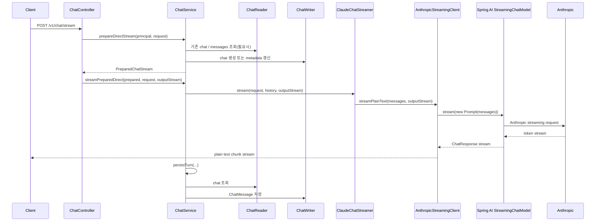

### 6.3 Direct Chat에서 중요한 포인트

- `ChatService`는 **세션 준비와 저장**을 담당한다.
- `ClaudeChatStreamer`는 **프롬프트 구성과 메시지 조립**에 집중한다.
- `AnthropicStreamingClient`는 **모델 호출과 토큰 전달**에 집중한다.
- 즉, 책임이 비교적 분명하게 분리되어 있다.

---

## 7. RAG Chat 논리 흐름

대상 엔드포인트:

- `POST /v1/rag/chat`

관련 주요 클래스:

- `RagController`
- `RagService`
- `RagChatStreamer`
- `RagAgent`
- `RagReader`
- `RagVectorStoreRepository`
- `RagEmbeddingModel`
- `AnthropicStreamingClient`
- `ChatService`

### 7.1 흐름 설명

1. 클라이언트가 `RagController.chat(...)`로 요청한다.
2. `RagService.prepareChat(...)`이 내부적으로 `ChatService.prepareRagStream(...)`을 호출한다.
3. Direct Chat과 마찬가지로,
   - 기존 채팅 재사용 여부 확인
   - 새 채팅 생성 또는 메타데이터 갱신
   - history 확보
   가 먼저 수행된다.
4. 이후 `RagService.streamChat(...)`이 `RagChatStreamer.stream(...)`을 호출한다.
5. `RagChatStreamer`는 먼저 `RagAgent.buildContext(...)`를 호출한다.
6. `RagAgent`는
   - chord context
   - user question
   - song title
   을 바탕으로 여러 개의 검색 쿼리(`RagDecomposedQuery`)를 만든다.
7. 각 쿼리는 `RagReader.search(...)`로 전달된다.
8. `RagReader`는 `RagVectorStoreRepository.search(...)`를 호출한다.
9. `RagVectorStoreRepository`는 Spring AI `VectorStore.similaritySearch(...)`를 사용해 유사 청크를 찾는다.
10. `RagAgent`는 여러 검색 결과를 RRF로 융합하고 상위 결과를 뽑아 LLM 주입용 문자열로 변환한다.
11. 동시에 debug 정보도 만든다.
12. `RagChatStreamer`는 이 debug 정보를 먼저 특수 구분자로 스트리밍한다.
13. 그 다음 system prompt에
    - rule-based 분석 결과
    - 검색된 RAG 문맥
    을 붙여 LLM 메시지를 구성한다.
14. 이후 `AnthropicStreamingClient`가 Direct Chat과 동일하게 스트리밍 호출을 수행한다.
15. 응답 종료 후 `ChatService.persistTurn(...)`가 user/assistant 메시지를 저장한다.

### 7.2 RAG Chat 시퀀스 다이어그램

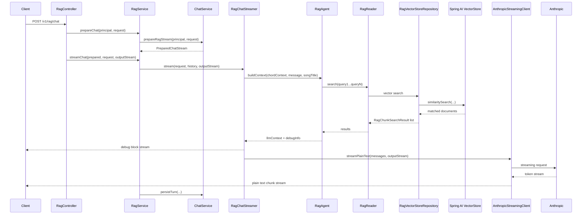

### 7.3 RAG에서 중요한 포인트

- RAG는 LLM 호출 전에 **검색 문맥 생성 단계**가 하나 더 있다.
- 검색 결과는 단순 1회 검색이 아니라,
  **쿼리 분해 → 다중 검색 → RRF 융합** 구조를 가진다.
- 사용자는 응답 본문 이전에 debug block을 받을 수 있어,
  “어떤 문서가 왜 사용되었는지”를 추적하기 쉽다.

---

## 8. RAG 검색 내부 흐름

RAG의 핵심은 `RagAgent`다.

### 8.1 `RagAgent`가 하는 일

`RagAgent`는 검색을 직접 수행하는 저장소가 아니라,
**검색 전략을 만드는 두뇌 역할**을 한다.

주요 단계:

1. **Query Decomposition**
   - chord function이 `II7`, `V7`, `T` 등인지 보고 쿼리를 만든다.
   - secondary dominant, modal interchange, tritone substitution, dim 계열 여부도 반영한다.
   - song title이 있으면 곡 기반 검색 쿼리를 앞쪽에 추가한다.
   - user question이 있으면 질문 중심 쿼리도 추가한다.

2. **Route and Retrieve**
   - 각 쿼리마다 `RagReader.search(...)`를 호출한다.
   - query별 상위 결과를 모은다.

3. **Fusion (RRF)**
   - 여러 쿼리에서 반복적으로 상위에 나온 청크를 더 신뢰한다.
   - 점수 스케일 차이를 줄이기 위해 RRF를 사용한다.

4. **LLM Context Formatting**
   - 최종 선택된 청크를 `[관련 강의 내용 (HarmoRAG)]` 형태의 문자열로 정리한다.
   - 이 문자열이 system prompt 뒤에 붙는다.

### 8.2 RAG 검색 흐름도

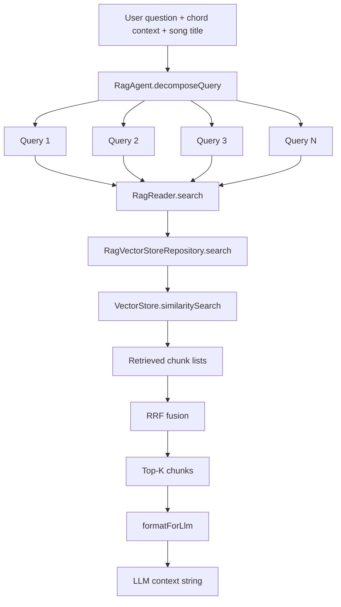

### 8.3 RAG 검색 시퀀스 다이어그램

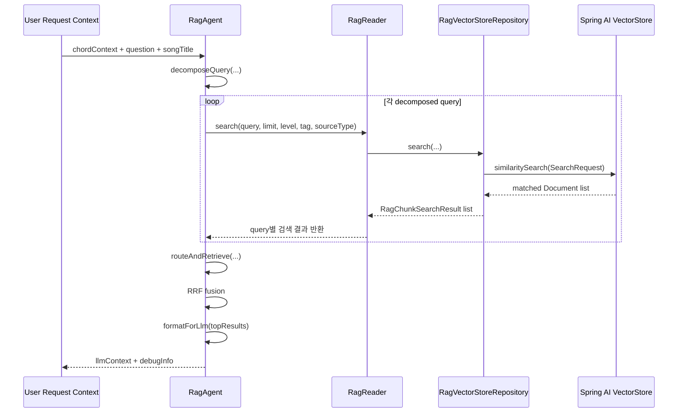

---

## 9. Spring AI / Anthropic / VectorStore 동작 흐름

사용자가 요청한 범위 안에서,
실제 Spring AI 의존성이 어디서 어떻게 동작하는지도 함께 정리한다.

### 9.1 LLM 호출 쪽

Jazzify 코드에서 Spring AI는 아래처럼 사용된다.

1. `ClaudeChatStreamer` 또는 `RagChatStreamer`가 Spring AI `Message` 목록 생성
2. `AnthropicStreamingClient`가 `new Prompt(messages)` 생성
3. `StreamingChatModel.stream(...)` 호출
4. Spring AI가 Anthropic 모델 요청/응답 형식을 처리
5. Jazzify는 응답 토큰 텍스트만 받아 `OutputStream`에 기록

즉,
Jazzify는 Anthropic SDK 세부 이벤트를 직접 다루지 않고,
**Spring AI의 `StreamingChatModel` 추상화 위에서 동작**한다.

### 9.2 RAG 검색 쪽

RAG에서는 Spring AI가 아래 역할을 맡는다.

1. `RagVectorStoreConfig`가 `PgVectorStore` 빈 생성
2. `RagEmbeddingModel`이 Spring AI `EmbeddingModel` 구현체 역할 수행
3. `RagVectorStoreRepository`가 `VectorStore.add(...)`, `similaritySearch(...)`, `delete(...)` 사용
4. 실제 저장소는 PostgreSQL + pgvector

즉,
RAG의 검색 전략은 커스텀이고,
**벡터 저장/검색 엔진은 Spring AI 인프라에 위임**하는 구조다.

### 9.3 Spring AI 흐름도

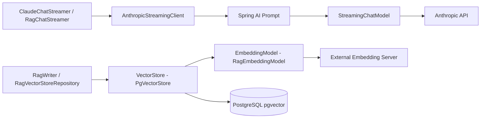

설명:

- 위쪽은 **채팅 생성 경로**다.
- 아래쪽은 **RAG 벡터 저장/검색 경로**다.
- `RagEmbeddingModel`은 Spring AI 인터페이스를 구현하지만,
  실제 벡터 생성은 외부 임베딩 서버를 호출한다.

### 9.4 LLM 스트리밍 내부 시퀀스 다이어그램

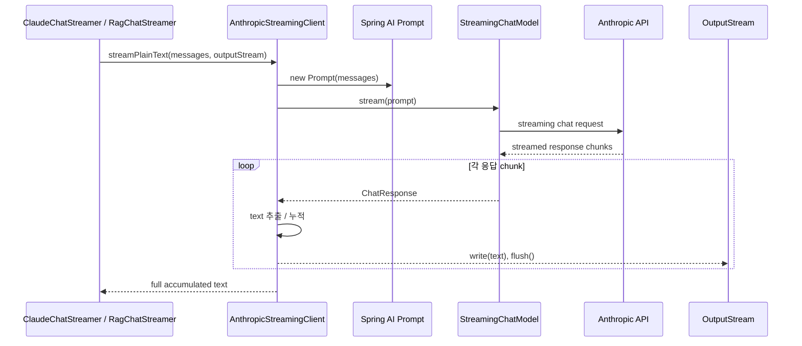

### 9.5 벡터 검색 / 임베딩 내부 시퀀스 다이어그램

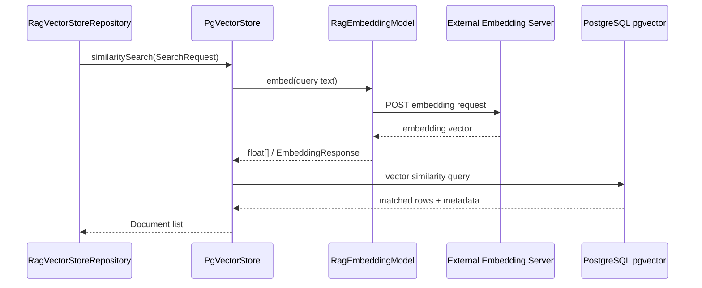

---

## 10. 채팅 영속화 구조

Direct Chat과 RAG Chat은 모두 아래 구조로 저장된다.

- `Chat`: 채팅 세션 메타데이터
- `ChatMessage`: 개별 메시지

### 10.1 저장 흐름

1. 스트림 시작 전에 `ChatService.prepare...`가 채팅 세션을 준비한다.
2. 새 세션이면 `ChatWriter.create(...)`로 `Chat` 생성
3. 기존 세션이면 `ChatReader.getChatByPublicId(...)`로 조회
4. 스트림 종료 후 `persistTurn(...)`에서
   - user message
   - assistant message
   를 `ChatMessage`로 append

### 10.2 영속화 흐름도

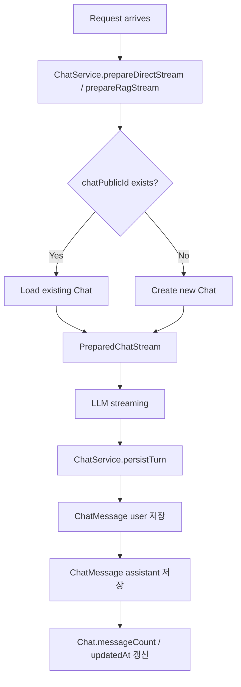

### 10.3 채팅 영속화 시퀀스 다이어그램

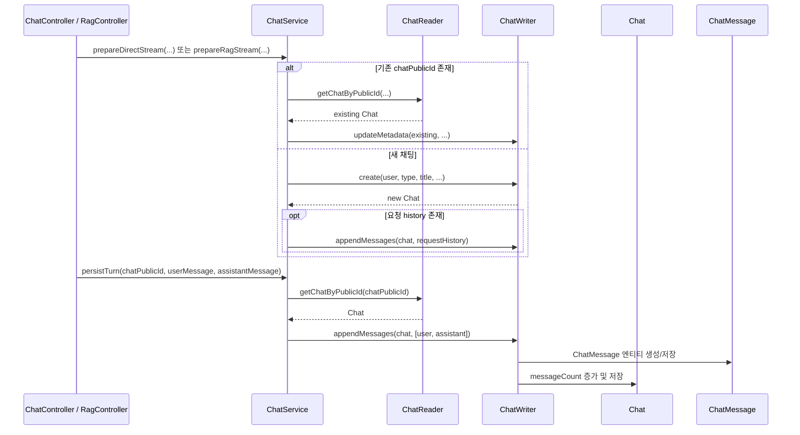

---

## 11. 클래스 역할 표

아래 표는 **RAG / LLM 논리 흐름에 직접 관여하는 Spring Java 클래스만** 정리한다.

### 11.1 Direct Chat / 공통 Chat 계층

| 클래스 | 계층 | 역할 |
|---|---|---|
| `ChatController` | controller | Direct Chat 스트리밍 엔드포인트와 채팅 조회 엔드포인트를 제공한다. |
| `ChatService` | service | Direct/RAG 공통 채팅 세션 준비, 히스토리 기준 결정, 스트리밍 후 턴 저장을 오케스트레이션한다. |
| `ClaudeChatStreamer` | implementation | Direct Chat용 system prompt와 Spring AI 메시지 목록을 구성하고 LLM 스트리밍 호출을 위임한다. |
| `ChatReader` | implementation | 사용자 소유 채팅, 채팅 메시지 이력을 조회한다. |
| `ChatWriter` | implementation | `Chat` 생성, 메타데이터 갱신, `ChatMessage` append를 담당한다. |
| `Chat` | entity | 채팅 세션 루트 엔티티다. 채팅 타입, 제목, 카테고리, 곡 제목, 메시지 수를 가진다. |
| `ChatMessage` | entity | user/assistant 메시지를 저장하는 개별 턴 엔티티다. |
| `ChatType` | model | 채팅이 `DIRECT`인지 `RAG`인지 구분한다. |
| `ChatHistoryMessage` | model | LLM 프롬프트에 투입할 과거 대화 메시지 표현이다. |
| `ChatMessageDraft` | model | 저장 직전의 임시 메시지 표현이다. |
| `ChatAnalysisCategory` | model | Direct Chat에서 분석 초점을 조절하는 카테고리 enum이다. |
| `ChatMapper` | util | 엔티티와 DTO, 내부 history 모델 간 변환을 담당한다. |

### 11.2 LLM 호출 공통 계층

| 클래스 | 계층 | 역할 |
|---|---|---|
| `AnthropicStreamingClient` | shared llm | Spring AI `StreamingChatModel`을 사용해 Anthropic 스트리밍 응답을 받고, 토큰을 `OutputStream`으로 즉시 흘려보낸다. |
| `AnthropicClientConfig` | shared llm config | Anthropic 관련 Spring 구성 진입점 역할을 한다. |
| `AnthropicProperties` | shared llm config | Anthropic API 키, base URL, 모델, max tokens 기본값을 관리한다. |

### 11.3 RAG 계층

| 클래스 | 계층 | 역할 |
|---|---|---|
| `RagController` | controller | RAG 채팅, 문서 관리, 검색, 헬스체크 엔드포인트를 노출한다. |
| `RagService` | service | RAG 문서 CRUD, 검색, 헬스체크, RAG 채팅 스트리밍 오케스트레이션을 담당한다. |
| `RagChatStreamer` | implementation | RAG 문맥 생성, debug block 선출력, RAG 전용 system prompt 조립 후 LLM 스트리밍을 수행한다. |
| `RagAgent` | implementation | 쿼리 분해, 다중 검색, RRF 융합, LLM 주입용 컨텍스트 생성의 핵심 전략 계층이다. |
| `RagReader` | implementation | RAG 문서 조회와 벡터 검색 결과 조회를 담당한다. |
| `RagWriter` | implementation | 문서를 chunk로 분해하고, 문서 저장/갱신/삭제 시 벡터 저장소와 동기화한다. |
| `RagFileChunker` | implementation | 텍스트 문서를 메타데이터와 chunk 단위로 분해해 임베딩/저장 가능한 구조로 변환한다. |
| `RagBootstrapRunner` | implementation | 애플리케이션 시작 시 스키마 초기화 및 파일 기반 bootstrap을 수행한다. |
| `RagEmbeddingModel` | implementation | 외부 임베딩 서버를 Spring AI `EmbeddingModel` 인터페이스로 감싼 어댑터다. |
| `RagEmbeddingClient` | implementation | 외부 임베딩 서버를 직접 호출하는 별도 클라이언트다. 현재 구조상 핵심 경로보다는 보조/과거 호환 성격이 강하다. |
| `RagDocumentRepository` | repository | RAG 문서 원본 메타데이터와 본문을 PostgreSQL에서 관리한다. |
| `RagVectorStoreRepository` | repository | Spring AI `VectorStore`를 사용해 청크 적재, 유사도 검색, 문서 단위 삭제, 카운트를 수행한다. |
| `RagVectorStoreConfig` | config | `PgVectorStore`를 `rag.enabled=true`일 때만 등록한다. |
| `RagDataSourceConfig` | config | RAG 전용 PostgreSQL 데이터소스, JDBC, 트랜잭션 매니저를 등록한다. |
| `RagProperties` | config | RAG 활성화, 데이터소스, bootstrap, embedding, retrieval, vector-store 설정을 관리한다. |
| `RagDocument` | model | RAG 문서 원본의 애플리케이션 모델이다. |
| `RagChunkSearchResult` | model | 유사도 검색으로 찾은 청크와 점수, 메타데이터를 표현한다. |
| `RagDecomposedQuery` | model | RAG가 생성한 개별 검색 쿼리 표현이다. |
| `RagDocumentDraft` | model | 문서 생성/수정 시점의 임시 입력 모델이다. |
| `RagSourceType` | model | 문서가 standard/lesson 등 어떤 출처 그룹인지 나타낸다. |
| `RagMapper` | util | RAG 모델과 응답 DTO 간 변환을 수행한다. |

### 11.4 저장 공통 기반

| 클래스 | 계층 | 역할 |
|---|---|---|
| `BaseEntity` | shared persistence | JPA 엔티티 공통 PK, `publicId`, 생성/수정 시각을 제공한다. |

---

## 12. 클래스 간 논리 흐름도

### 12.1 Direct Chat 클래스 흐름

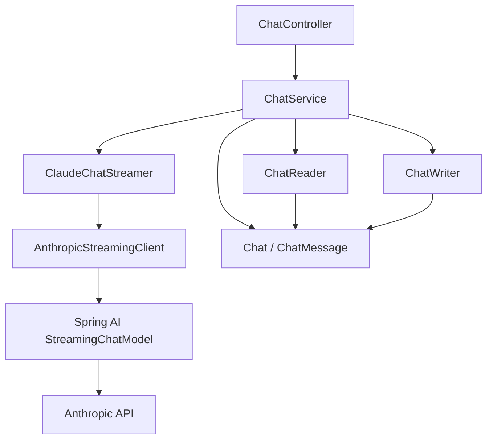

### 12.2 RAG Chat 클래스 흐름

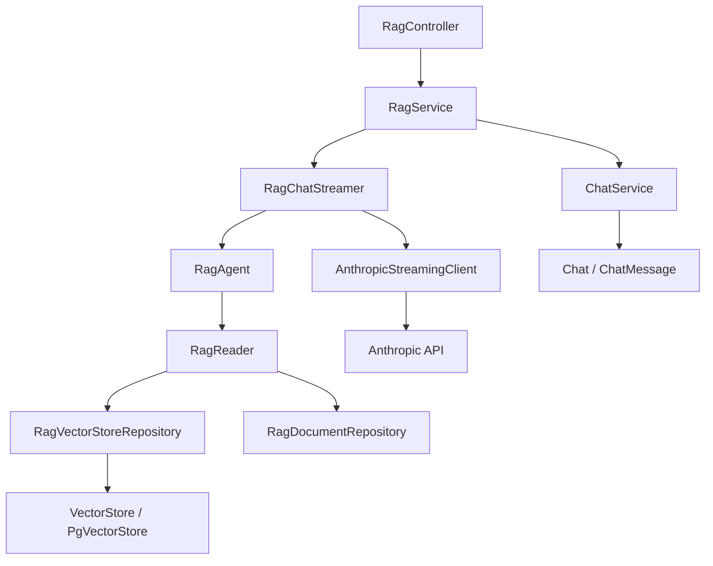

### 12.3 문서 저장/색인 클래스 흐름

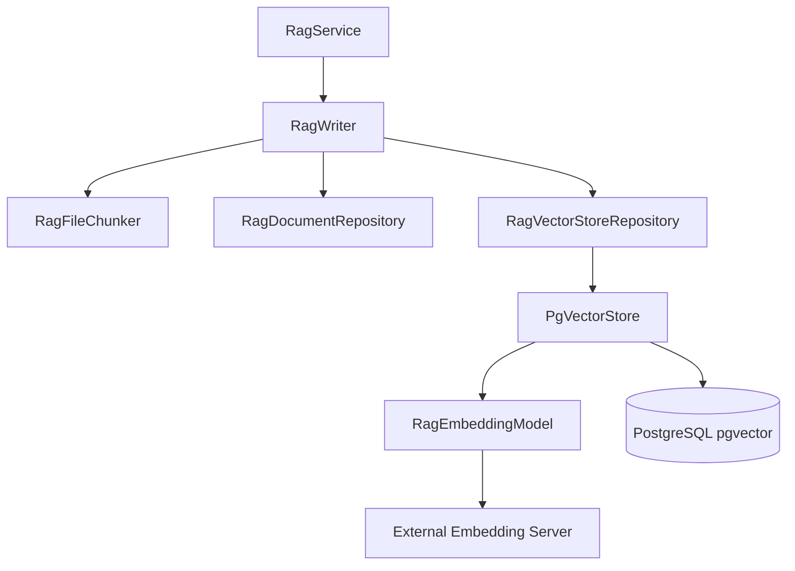

### 12.4 문서 저장/색인 시퀀스 다이어그램

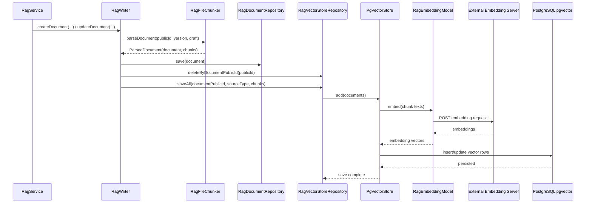

---

## 13. 개발자가 알아둬야 하는 내용

### 13.1 RAG와 Direct Chat의 진짜 차이는 “컨텍스트 생성 단계”다

두 흐름 모두 최종적으로는 Anthropic 모델 스트리밍 호출로 끝난다.
차이는 그 전에 붙는 문맥이다.

- Direct Chat: conversation history + user message
- RAG Chat: conversation history + user message + retrieved context

즉, 모델 호출기는 공통이고 **프롬프트 재료가 다르다**고 이해하면 된다.

### 13.2 `ChatService`는 공통 세션 계층이다

RAG도 별도 채팅 엔티티를 만들지 않고 `ChatService`를 재사용한다.
따라서 채팅 이어쓰기, `chatPublicId`, 히스토리 저장 규칙은 Direct/RAG 모두 같은 철학을 공유한다.

### 13.3 RAG는 “문서 DB”와 “벡터 저장소”를 분리해서 본다

현재 구조에서 의미가 다르다.

- `rag_document`: 원문/메타데이터 저장
- `rag_chunk_store`(기본값): 벡터 검색용 청크 저장

즉 문서 CRUD와 벡터 검색은 같은 개념이 아니라,
**원본 저장소 + 검색 인덱스 저장소**의 관계다.

### 13.4 `RagAgent`가 RAG 품질의 핵심이다

RAG 정확도는 단순히 벡터스토어가 아니라,
어떤 질의들을 만들고 어떻게 융합하느냐에 크게 좌우된다.

따라서 검색 품질을 바꾸고 싶다면 우선 아래를 봐야 한다.

- `RagAgent.decomposeQuery(...)`
- `RagAgent.routeAndRetrieve(...)`
- `rag.retrieval.*` 설정값

### 13.5 `RagEmbeddingModel`은 Spring AI 적응 계층이다

실제 임베딩 계산은 외부 서버가 하지만,
애플리케이션 입장에서는 Spring AI `EmbeddingModel`로 보이게 만들어 두었다.

이것은 향후 임베딩 공급자를 교체할 때 유리하다.

### 13.6 스트리밍 저장은 finally 블록 기반이다

`ChatService.streamPreparedDirect(...)`와 `RagService.streamChat(...)`는 모두
`try/finally`로 assistant 응답 저장을 보장한다.

즉, 응답 도중 예외가 나더라도 가능한 범위에서 user 턴 저장 흐름은 유지하려는 설계다.

---

## 14. 이번 문서에서 내가 스스로 결정한 정리 기준

명시 지시가 없어서 아래는 문서 작성 시 내가 판단해서 정리한 부분이다.

1. **파이썬 구현은 완전히 제외했다.**
   - 기존 비교 문서가 있었지만, 이번 문서는 사용자 추가 제약에 맞춰 Spring Java 코드만 대상으로 삼았다.

2. **RAG/LLM 바깥 도메인은 추상화했다.**
   - 인증, analysis, chordproject 등은 흐름 이해에 필요한 접점만 언급하고 내부 로직은 생략했다.

3. **클래스 표는 “실제 호출 흐름에 직접 관련된 클래스” 중심으로 추렸다.**
   - 모든 DTO/Spec/테스트 클래스까지 확장하면 문서 초점이 흐려져 제외했다.

4. **Spring AI 내부 구현 디테일은 추상화했다.**
   - 라이브러리 내부 네트워크 스택이나 세부 직렬화 로직보다는, Jazzify 코드에서 어떤 추상화를 사용 중인지에 초점을 맞췄다.

---

## 15. 한 줄 결론

현재 Jazzify의 Spring Java 구조에서,

- **Direct Chat**은 `ChatService + ClaudeChatStreamer + AnthropicStreamingClient`
- **RAG Chat**은 `ChatService + RagChatStreamer + RagAgent + VectorStore + AnthropicStreamingClient`

조합으로 이해하면 가장 정확하다.

즉,

> **LLM은 공통 스트리밍 호출기로 수렴하고, RAG는 그 앞단에 검색 문맥 생성 계층이 하나 더 붙는 구조다.**

